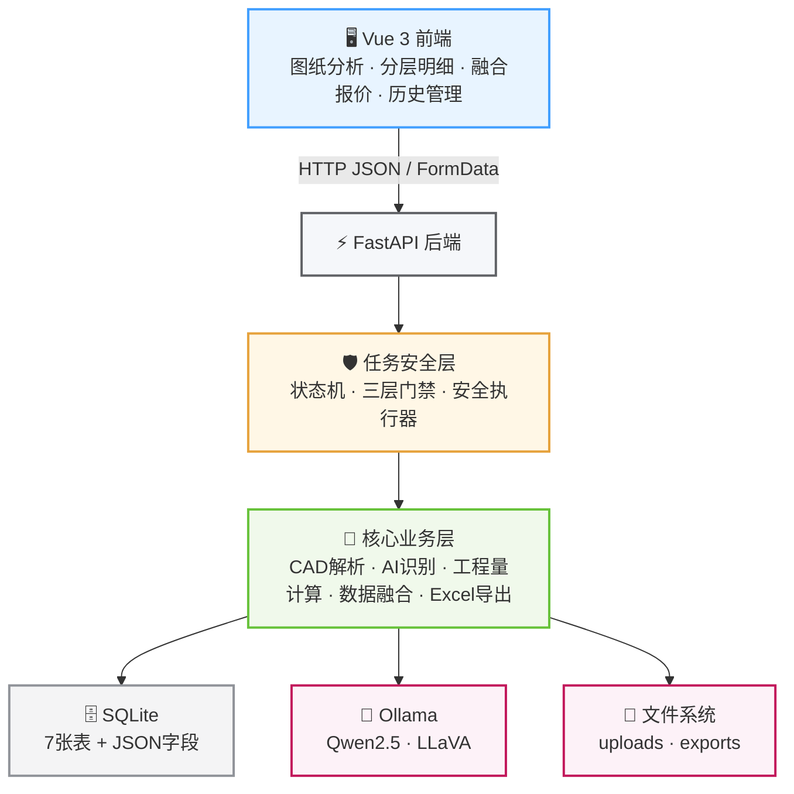
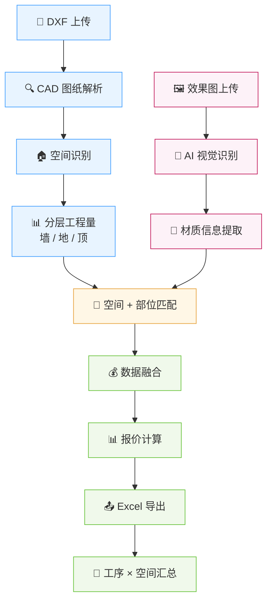
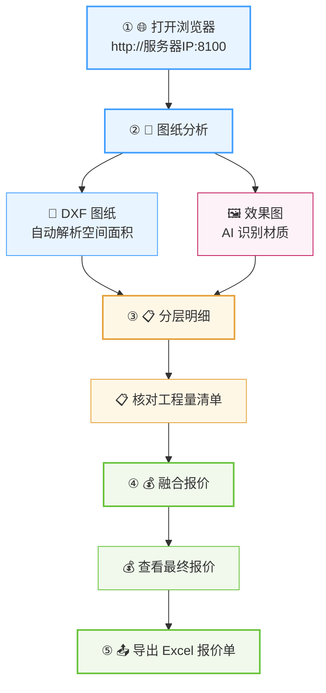

# 🏠 BuildSight — 家装智能自动报价系统

> **让图纸读懂空间，让 AI 理解材质，让报价自动生成。**

BuildSight 是一套面向家装场景的 **智能自动报价系统**，通过 **CAD 图纸矢量解析 + AI 视觉识别 + 工程量计算 + 数据融合**，实现从图纸上传、空间识别、材质分析，到工程量计算与报价导出的全链路自动化。

📐 **CAD 图纸解析** → 🖼️ **AI 效果图识别** → 🔗 **数据融合** → 📊 **工程量计算** → 💰 **智能报价** → 📤 **Excel 导出**

---

## 📌 项目概览

| 项目 | 信息 |
|------|------|
| 📦 项目名称 | **BuildSight** |
| 🏷️ 当前版本 | `v2.1.0` |
| 🐍 后端语言 | Python 3.10+ |
| 🖥️ 前端框架 | Vue 3 |
| ⚡ 后端框架 | FastAPI |
| 🗄️ 数据库 | SQLite |
| 🤖 AI 推理 | Ollama + LLaVA / Qwen |
| 🎨 UI 技术 | TailwindCSS + Element Plus |
| 🧊 3D / CAD | Three.js + mlightcad |
| 📊 数据导出 | Excel |

---

## 📋 目录

- [✨ 项目简介](#-项目简介)
- [🚀 核心功能](#-核心功能)
- [🏗️ 系统架构](#️-系统架构)
- [🔄 数据处理流程](#-数据处理流程)
- [🛡️ 任务安全机制](#️-任务安全机制)
- [🧰 技术栈](#-技术栈)
- [💻 环境要求](#-环境要求)
- [⚡ 快速开始](#-快速开始)
- [📖 使用指南](#-使用指南)
- [❓ 常见问题](#-常见问题)
- [📁 项目结构](#-项目结构)
- [📮 联系方式](#-联系方式)

---

# ✨ 项目简介

BuildSight 面向家装报价业务，将传统的 **CAD 工程量计算** 与 **AI 效果图理解**结合起来，解决人工读取图纸、识别材质以及整理报价数据效率较低的问题。

### 🎯 核心价值

- 📐 **CAD 图纸矢量解析**
  - 支持 DXF 等图纸数据解析
  - 自动识别空间、面积、周长及长宽等信息

- 🖼️ **效果图 AI 材质识别**
  - 调用本地视觉模型
  - 自动识别空间类型以及墙面、地面、顶面材质

- 🔗 **CAD + AI 双线数据融合**
  - CAD 提供准确的空间与工程量数据
  - AI 提供效果图中的材质信息
  - 根据「空间 + 部位」自动完成数据匹配

- 📊 **分层工程量计算**
  - 墙面
  - 地面
  - 顶面
  - 自动处理门窗洞口扣减

- 💰 **智能报价**
  - 将工程量、材质、施工工序和定价配置进行统一融合
  - 自动生成标准化报价结果

- 📤 **Excel 报价导出**
  - 支持完整报价单导出
  - 包含工程明细、工序汇总、定价配置和材质对照等数据

---

# 🚀 核心功能

| 功能 | 说明 |
|------|------|
| 📐 CAD 图纸解析 | 支持 `.dxf/.dwg/.pdf`，自动识别空间名称、面积、周长、长宽 |
| 🖼️ 效果图 AI 识别 | 调用 Ollama 本地视觉模型，识别空间类型和装修材质 |
| 📊 分层工程量计算 | 墙面 / 地面 / 顶面独立计算，并自动扣减门窗洞口 |
| 🔍 智能材质匹配 | 采用 6 层匹配策略：精确 → 子串 → 同义词 → 拼音 → 模糊 |
| 🔗 数据融合 | CAD 工程量 + AI 材质信息 → 标准化报价 |
| 📤 Excel 导出 | 输出 4 个 Sheet：工程明细 / 工序汇总 / 定价配置 / 材质对照 |
| 🔧 工序管理 | 内置 10 项标准施工工序，支持自定义和批量更新单价 |
| 🕘 历史管理 | 自动记录报价操作，支持历史查询与结果追溯 |
| 📝 操作日志 | 记录系统关键操作和运行状态 |

---

# 🏗️ 系统架构



---

# 🔄 数据处理流程

BuildSight 的核心业务流程可以概括为：



### 🔗 数据融合逻辑

系统主要按照：

> **空间名称 + 部位**

进行自动匹配，将：

- CAD 空间数据
- CAD 工程量
- AI 材质数据
- 材质映射
- 施工工序
- 定价配置

统一融合，最终生成报价结果。

---

# 🛡️ 任务安全机制

系统通过三层门禁控制任务执行，避免异常文件和并发任务影响系统稳定性。

### 1️⃣ 文件门禁

对上传文件进行格式和大小校验：

- 📐 CAD：`.dxf / .dwg`
- 🖼️ 图片：`.jpg / .png`
- 📄 PDF：`.pdf`
- 📦 CAD 最大：120 MB
- 🖼️ 图片最大：10 MB

### 2️⃣ 混装门禁

> 🚫 同一个请求禁止同时上传 CAD 图纸和效果图。

CAD 解析与 AI 图像识别分别使用独立任务流程。

### 3️⃣ 忙状态门禁

系统采用固定任务状态机，同一时间只允许一个核心任务执行。

```text
idle
 │
 ├──→ cad_running ──→ idle
 │
 ├──→ ai_running ───→ idle
 │
 ├──→ merge_running ─→ idle
 │
 └──→ export_running → idle
```

---

# 🧰 技术栈

## ⚡ 后端

| 组件 | 版本 | 用途 |
|------|------|------|
| FastAPI | 0.115.6 | Web API 框架 |
| Uvicorn | 0.34.0 | ASGI 服务器 |
| ezdxf | 1.3.5 | DXF 文件解析 |
| Shapely | 2.0.6 | 几何计算 |
| PyMuPDF | 1.25.4 | PDF 处理 |
| Pillow | 11.1.0 | 图像处理 |
| openpyxl | - | Excel 导出 |
| aiosqlite | 0.22.1 | SQLite 异步操作 |
| python-dotenv | 1.0.1 | 环境变量管理 |

## 🖥️ 前端

| 组件 | 版本 | 用途 |
|------|------|------|
| Vue | 3.5.13 | 前端框架 |
| Vite | 6.0.7 | 构建工具 |
| Element Plus | 2.14.2 | UI 组件库 |
| TailwindCSS | 3.4.17 | 原子化 CSS |
| @mlightcad/* | ~1.8.3 | CAD 查看器 |
| Three.js | 0.172.0 | 3D 渲染 |

## 🤖 AI 模型

| 模型 | 用途 | 备注 |
|------|------|------|
| `qwen2.5:7b` | 默认视觉识别 | 综合评分最优 |
| `llava:7b` | 备用视觉模型 | 推理速度较快 |
| `qwen2.5vl` | 视觉专用模型 | 高精度识别 |

> 远程大模型在`识别测试`模块添加

---

# 💻 环境要求

| 环境 | 要求 |
|------|------|
| 🐍 Python | 3.10+ |
| 🟢 Node.js | 18+ |
| 🤖 Ollama | 已安装并运行 |
| 🌐 浏览器 | Chrome 90+ / Edge 90+ / Firefox 90+ |
| 🧠 内存 | 建议 8 GB+ |

> 💡 如果需要运行较大的 CAD 图纸或视觉模型，建议使用更高配置的 CPU / 内存 / GPU 环境。

---

# ⚡ 快速开始

## 1️⃣ 安装 Ollama

Linux 环境：

```bash
curl -fsSL https://ollama.com/install.sh | sh
```

拉取视觉模型：

```bash
ollama pull qwen2.5:7b
ollama pull llava:7b
```

## 2️⃣ 启动后端

进入项目目录：

```bash
cd /home/work/python/buildsight
```

执行一键启动：

```bash
bash start.sh
```

启动脚本会完成依赖安装及 Ollama 环境检查。

启动成功后访问（需要先构建前端）：

```text
http://localhost:8100
```

---

## 3️⃣ 停止服务

```bash
bash stop.sh
```

---

## 4️⃣ 手动启动

如果不使用启动脚本，可以手动运行：

```bash
# 激活虚拟环境
source venv/bin/activate

# 安装依赖
cd backend
pip install -r requirements.txt

# 启动服务
uvicorn main:app --host 0.0.0.0 --port 8100 --reload
```

---

# 📖 使用指南

## 🔄 标准操作流程



---

## ⚠️ 使用注意事项

| 规则 | 说明 |
|------|------|
| ⛔ 禁止混合上传 | CAD 图纸和效果图不能在同一请求中上传 |
| 🔒 任务处理中请等待 | 按钮变灰表示系统正在处理任务 |
| 👀 AI 结果需要复核 | 当前材质识别准确率约 50%，建议人工检查 |
| ⚙️ 修改定价后重新融合 | 定价配置修改后，需要重新执行融合报价 |

---

## 🧭 页面功能

系统目前包含多个核心功能页面：

| 页面 | 功能 |
|------|------|
| 🏠 首页 | 系统状态概览、快捷入口 |
| 📐 图纸分析 | 上传 DXF 图纸和效果图 |
| 💰 融合报价 | 查看最终报价结果 |
| 📊 历史记录 | 查询历史报价 |
| ⚙️ 定价配置 | 设置单价和报价模板 |
| 🔧 施工工序 | 管理施工工序和工艺 |
| 📝 操作日志 | 查看系统运行日志 |

---

# ❓ 常见问题

## 1. 🚫 服务无法启动？

检查 8100 端口是否被占用：

```bash
lsof -i :8100
```

停止旧进程：

```bash
bash stop.sh
```

重新启动：

```bash
bash start.sh
```

---

## 2. 🤖 Ollama 模型未找到？

检查 Ollama 服务：

```bash
curl http://localhost:11434/api/tags
```

重新拉取模型：

```bash
ollama pull qwen2.5:7b
ollama pull llava:7b
```

---

## 3. 🐌 CPU 笔记本运行较慢？

CPU 环境下 `qwen2.5:7b` 推理速度较慢，目前约为 **30～60 秒 / 张**。

可以尝试使用更轻量的：

```bash
ollama pull moondream
```

`moondream` 约 1.8B 参数，在 CPU 环境下通常具有更快的推理速度。

安装后，可在系统首页的模型选择区域切换至：

```text
moondream
```

---

## 4. 🖼️ 图纸传错怎么办？

进入：

> 📊 **历史记录**

删除错误图纸后重新上传即可。

---

## 5. 💰 报价结果不正确？

进入：

> 📋 **分层明细**

重点检查：

- 空间识别是否正确
- 墙 / 地 / 顶工程量是否正确
- 材质匹配是否正确
- 定价配置是否正确

确认数据后重新执行融合报价。

---

# 📁 项目结构

```text
buildsight/
│
├── backend/                       # ⚡ 后端服务
│   ├── main.py                   # FastAPI 主服务
│   ├── cad_parser.py             # 📐 CAD 解析模块
│   ├── dxf_measurement.py        # 📏 DXF 测量模块
│   ├── image_recognizer.py       # 🖼️ AI 视觉识别
│   ├── quantity_estimator.py     # 📊 工程量估算
│   ├── fusion_validator.py       # 🔗 数据融合
│   ├── deduct_rule.py            # ➖ 扣减规则
│   ├── excel_export.py           # 📤 Excel 导出
│   ├── db.py                     # 🗄️ 数据库操作
│   ├── space_synonyms.py         # 🔍 空间同义词映射
│   │
│   ├── config/                   # ⚙️ 配置文件
│   │   └── manual_annotation.toml
│   │
│   ├── uploads/                  # 📥 上传文件
│   └── data/                     # 📦 数据文件
│
├── frontend/                     # 🖥️ Vue 前端
│   ├── src/
│   │   ├── App.vue               # 主组件
│   │   ├── components/           # Vue 组件
│   │   ├── services/             # API 服务
│   │   └── utils/                # 工具函数
│   │
│   └── public/workers/           # Web Workers
│
├── docs/                         # 📚 项目文档
│   ├── 01-需求分析阶段/
│   ├── 02-系统设计阶段/
│   ├── 03-编码实现阶段/
│   └── 07-用户手册/
│
├── scripts/                      # 🔧 脚本工具
├── start.sh                      # ▶️ 启动脚本
└── stop.sh                       # ⏹️ 停止脚本
```

---

> **从一张图纸，到一份报价。**
>
> 📐 让 CAD 告诉我们「空间有多大」  
> 🖼️ 让 AI 告诉我们「空间是什么」  
> 🔗 让系统完成「数据如何融合」  
> 💰 最终自动生成「一份可用的报价」

**BuildSight，让家装报价从人工整理走向智能自动化。** 🚀