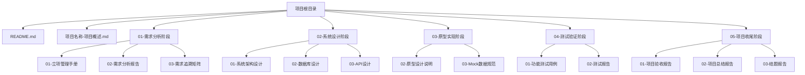

# Copilot提示词全集 - 项目分析指南

## 体系概述

### 核心价值

本提示词体系以**项目管理核心逻辑（PMBOK、CMMI）**为理论支撑，覆盖从**需求发起至验收交付**的全生命周期，实现 **"需求 - 设计 - 开发 - 测试 - 验收"** 的闭环管控与可追溯。

### 理论框架

本体系深度融合三大项目管理标准：

1. **PMBOK 6（项目管理知识体系指南第6版）**

   - **五大过程组**：启动、规划、执行、监控、收尾
   - **十大知识领域**：整合管理、范围管理、进度管理、成本管理、质量管理、资源管理、沟通管理、风险管理、采购管理、相关方管理
   - **49个管理过程**：提供详细的过程指导，明确输入、工具与技术、输出
2. **PMBOK 7（项目管理知识体系指南第7版）**

   - **八大绩效域**：利益相关者、团队、开发方法和生命周期、规划、项目工作、交付、测量、不确定性
   - **12条原则**：成为勤勉的管家、营造协作环境、有效参与、聚焦于价值、识别系统交互、展现领导力、根据环境裁剪、融入质量、驾驭复杂性、优化风险应对、拥抱适应性、实现商业价值
3. **CMMI（能力成熟度模型集成）**

   - **过程域**：项目策划、项目监控与控制、需求管理、技术解决方案、产品集成、验证、确认、配置管理、过程和产品质量保证、测量与分析等
   - **组织级能力**：组织过程焦点、组织过程定义、组织培训、组织过程绩效、组织创新与部署

### 体系特点

#### 1. 全生命周期覆盖

本体系覆盖软件工程全流程的各个阶段：

- **需求分析阶段**：项目启动、需求收集、需求分析、需求建模
- **系统设计阶段**：范围管理、系统架构设计、数据库设计、API设计
- **编码实现阶段**：代码框架生成、设计模式实现、数据库迁移
- **测试验证阶段**：测试用例生成、质量保证、配置管理
- **部署运维阶段**：项目监控、CI/CD配置、性能监控
- **项目收尾阶段**：项目验收、知识管理、项目总结

#### 2. 闭环管控与可追溯

建立完整的追溯体系，确保项目交付物的可追溯性：

- **需求追溯**：需求→设计→代码→测试→验收的完整追溯链
- **设计追溯**：系统设计→代码实现→测试用例的一致性验证
- **质量追溯**：质量标准→代码质量→测试覆盖率的闭环验证
- **变更追溯**：变更请求→影响分析→实施验证的变更管理

#### 3. 框架复用性

新项目可直接复用本框架目录结构：

- **标准化目录**：按照软件工程阶段组织的标准目录结构
- **模板化文档**：提供各类文档模板（立项管理手册、需求分析报告、系统架构设计等）
- **规范化流程**：标准化的项目管理流程和检查清单
- **工具化支持**：Copilot提示词支持快速生成各类文档和代码

#### 4. 理论与实践结合

本体系将项目管理理论与大模型工具（Copilot）深度融合：

- **理论指导实践**：PMBOK、CMMI理论指导提示词设计
- **实践验证理论**：通过Copilot生成的内容验证理论应用
- **持续优化改进**：基于实践反馈不断优化提示词和流程

### 使用场景

#### 1. 教学场景

- **教师**：作为教学参考，展示项目管理理论在实践中的应用
- **学生**：学习项目管理全流程，理解理论如何指导实践
- **课程**：支持《软件项目管理》课程的教学需求

#### 2. 项目实践场景

- **新项目启动**：直接复用框架目录，快速建立项目管理体系
- **项目执行**：使用提示词快速生成各类项目管理文档
- **项目收尾**：参考模板完成项目验收和总结

#### 3. 组织级应用场景

- **过程改进**：基于CMMI过程域要求，建立组织级项目管理能力
- **知识沉淀**：将项目经验沉淀为可复用的模板和规范
- **能力提升**：通过标准化流程提升团队项目管理能力

### 体系验证

本体系已进行初步测试，验证了以下方面：

- ✅ **理论完整性**：PMBOK 6、PMBOK 7、CMMI理论覆盖完整
- ✅ **实践可行性**：提示词能够有效生成符合理论要求的文档和代码
- ✅ **追溯有效性**：建立了有效的追溯机制，确保交付物可追溯
- ✅ **复用便捷性**：框架目录结构清晰，便于新项目复用

### 持续改进

本体系将持续优化改进，欢迎反馈：

- **问题反馈**：如发现体系中的问题，请及时反馈
- **优化建议**：欢迎提出优化建议，帮助体系不断完善
- **实践案例**：欢迎分享使用案例，丰富体系内容

---

## 文档说明

本文档是一个**独立的项目开发智能体提示词库**，包含92个Copilot提示词，覆盖软件项目全生命周期。通过Copilot快速生成符合PMBOK、CMMI、GB/T 31102-2025、GB/T 42965-2023四个标准体系要求的管理文档和代码工程。

**文档版本**：V2.2
**创建日期**：2025年1月
**最后更新**：2025年1月（优化：增加目录结构生成和文档标准格式约束，确保体系生成一致性）
**维护者**：教材编写团队

### 版本更新说明（V2.2）

**优化内容**：

1. **新增目录结构生成提示词**：提示词91（项目目录结构生成），确保每次生成的目录结构一致
2. **新增文档标准格式提示词**：提示词92（文档标准格式生成），确保每个文档的格式统一
3. **优化现有提示词**：为提示词1-90增加目录结构要求、文档格式要求、一致性检查三个部分
4. **增强使用指南**：新增目录结构生成指南、文档格式标准化指南、一致性检查机制
5. **完善约束机制**：建立目录结构约束、文档格式约束、一致性检查机制，确保体系生成一致性

**提示词总数**：92个（新增2个：提示词91、92）

### 版本更新说明（V2.1）

**优化内容**：

1. **独立文档化**：移除所有章节关联，使文档成为独立的项目开发智能体提示词库
2. **按阶段组织**：按照软件工程阶段（需求分析、系统设计、编码实现、测试验证、部署运维、项目收尾）组织提示词
3. **增强标准体系标注**：为每个提示词添加GB/T 31102-2025知识域和GB/T 42965-2023能力域的标注
4. **优化使用指南**：更新使用指南，移除章节依赖，按项目阶段和管理域查找提示词
5. **完善映射表**：添加提示词与知识域、能力域的完整映射表

---

## 如何使用提示词全集（项目开发智能体使用指南）

### 快速开始

**作为项目开发智能体，你可以：**

1. **按章节查找提示词**：根据项目当前阶段，查找对应章节的提示词
2. **按知识域查找提示词**：根据GB/T 31102-2025知识域查找相关提示词
3. **按能力域查找提示词**：根据GB/T 42965-2023能力域查找相关提示词
4. **组合使用提示词**：多个提示词组合形成完整的工作流程
5. **定制化提示词**：根据项目特点，替换项目名称、技术栈等参数

### 使用流程

#### 步骤1：确定项目阶段

根据项目当前阶段，选择对应的软件工程阶段：

| 项目阶段 | 软件工程阶段 | 提示词编号范围 |
| -------- | ------------ | -------------- |
| 项目启动 | 需求分析阶段 | 1-4, 84        |
| 需求分析 | 需求分析阶段 | 5-15, 85-87    |
| 成本管理 | 系统设计阶段 | 16-20          |
| 进度管理 | 系统设计阶段 | 25, 86         |
| 质量管理 | 测试验证阶段 | 27-40, 87-88   |
| 沟通管理 | 管理支持阶段 | 73-78          |
| 风险管理 | 风险管理阶段 | 55-62          |
| 集成管理 | 部署运维阶段 | 41-54          |
| 迭代管理 | 迭代管理阶段 | 79-82          |
| 项目收尾 | 项目收尾阶段 | 63-72, 89-90   |

#### 步骤2：查找对应提示词

**方法1：按软件工程阶段查找**

- 查看"提示词按软件工程阶段组织"部分，找到对应阶段的所有提示词

**方法2：按管理域查找**

- 根据项目管理域（范围管理、成本管理、进度管理、质量管理等）查找相关提示词

**方法3：按知识域查找**

- 查看"GB/T 31102-2025知识域与提示词映射表"，找到对应知识域的提示词

**方法4：按能力域查找**

- 查看"GB/T 42965-2023能力域与提示词映射表"，找到对应能力域的提示词

#### 步骤3：使用提示词

**在VS Code中使用Copilot：**

1. **打开Copilot Chat**：按 `Ctrl+Shift+P`（Windows/Linux）或 `Cmd+Shift+P`（Mac），输入"Copilot Chat"
2. **输入提示词**：将提示词内容复制到Copilot Chat中
3. **定制化参数**：替换提示词中的项目名称、技术栈等参数
4. **生成内容**：Copilot会根据提示词生成符合标准的管理文档或代码

**示例**：

```
提示词：基于PMBOK 6的"制定项目章程"过程，为[项目名称]生成项目章程文档...

定制化后：基于PMBOK 6的"制定项目章程"过程，为"在线教育平台"生成项目章程文档...
```

#### 步骤4：验证生成内容

生成内容后，需要验证：

1. **理论验证**：检查生成内容是否符合PMBOK、CMMI、GB/T 31102-2025、GB/T 42965-2023要求
2. **内容完整性**：检查生成内容是否包含提示词要求的所有部分
3. **质量检查**：检查生成内容的质量和规范性

### 提示词组合使用

在实际项目中，多个提示词往往需要组合使用：

**示例：项目启动阶段**

1. 使用提示词1生成项目章程
2. 使用提示词2生成相关方分析
3. 使用提示词4生成基于PMBOK+CMMI的项目计划
4. 使用提示词84进行G0项目就绪门禁检查

**示例：需求分析阶段**

1. 使用提示词5生成WBS
2. 使用提示词7生成需求清单
3. 使用提示词8生成需求规格说明书
4. 使用提示词10生成Swagger API文档
5. 使用提示词85进行G1需求基线冻结门禁检查

### 提示词定制化

根据项目特点，可以对提示词进行定制化：

**定制化参数**：

- **项目名称**：将"成本管理系统"替换为实际项目名称
- **技术栈**：将"Node.js + Express + MySQL"替换为实际技术栈
- **项目周期**：将"16周"替换为实际项目周期
- **团队规模**：将"5人团队"替换为实际团队规模

**定制化示例**：

```
原提示词：为成本管理系统生成项目章程...
定制后：为[在线教育平台]（[Spring Boot + Vue.js + PostgreSQL]，[20周]周期，[8人]团队）生成项目章程...
```

### 标准体系对应

每个提示词都标注了对应的标准体系：

- **PMBOK 6过程**：明确要执行的PMBOK 6管理过程
- **PMBOK 7原则**：明确要遵循的PMBOK 7原则
- **PMBOK 7绩效域**：明确要支撑的PMBOK 7绩效域
- **CMMI过程域**：明确要符合的CMMI过程域要求
- **GB/T 31102-2025知识域**：明确对应的知识域
- **GB/T 42965-2023能力域**：明确对应的能力域和成熟度等级

### 智能体工作模式

**作为项目开发智能体，你可以：**

1. **理解项目需求**：根据项目描述，自动识别需要的提示词
2. **生成管理文档**：使用提示词生成符合标准的管理文档
3. **生成代码工程**：使用提示词生成符合规范的代码框架
4. **验证交付物**：使用门禁检查清单验证交付物质量
5. **建立追溯链**：确保需求→设计→代码→测试→验收的完整追溯

### 最佳实践

1. **先理解后使用**：在使用提示词前，先理解其对应的理论要求和标准体系
2. **组合使用**：多个提示词组合使用，形成完整的工作流程
3. **持续优化**：根据生成结果，不断优化提示词
4. **标准对齐**：确保生成内容符合四个标准体系的要求
5. **追溯验证**：建立完整的追溯链，确保交付物可追溯

---

---

## 目录

1. [如何使用提示词全集（项目开发智能体使用指南）](#如何使用提示词全集项目开发智能体使用指南)
2. [提示词按软件工程阶段组织](#提示词按软件工程阶段组织)
   - [零、项目目录结构生成](#零项目目录结构生成)
   - [一、需求分析阶段](#一需求分析阶段)
   - [二、系统设计阶段](#二系统设计阶段)
   - [三、编码实现阶段](#三编码实现阶段)
   - [四、测试验证阶段](#四测试验证阶段)
   - [五、部署运维阶段](#五部署运维阶段)
   - [六、项目收尾阶段](#六项目收尾阶段)
   - [七、管理支持阶段](#七管理支持阶段)
   - [八、迭代管理阶段](#八迭代管理阶段)
   - [九、门禁检查清单（G0-G5）](#九门禁检查清单g0-g5)
3. [提示词使用指南](#十提示词使用指南)
   - [9.4 目录结构生成指南](#94-目录结构生成指南)
   - [9.5 文档标准格式指南](#95-文档标准格式指南)
   - [9.6 一致性检查机制](#96-一致性检查机制)
4. [提示词使用最佳实践](#十一提示词使用最佳实践)
5. [总结](#十二总结)
6. [附录](#附录)
   - [附录A：提示词快速索引](#附录a提示词快速索引)
   - [附录B：GB/T 31102-2025知识域与提示词映射](#附录b-gbt-31102-2025知识域与提示词映射)
   - [附录C：GB/T 42965-2023能力域与提示词映射](#附录c-gbt-42965-2023能力域与提示词映射)
   - [附录D：PMBOK 6过程与提示词映射](#附录d-pmbok-6过程与提示词映射)
   - [附录E：PMBOK 7原则与提示词映射](#附录e-pmbok-7原则与提示词映射)
   - [附录F：PMBOK 7绩效域与提示词映射](#附录f-pmbok-7绩效域与提示词映射)
   - [附录G：CMMI过程域与提示词映射](#附录g-cmmi过程域与提示词映射)

---

## 提示词按软件工程阶段组织

> **说明**：提示词按照软件工程阶段组织，每个提示词都标注了对应的PMBOK理论定位、GB/T 31102-2025知识域和GB/T 42965-2023能力域。

## 零、项目目录结构生成

**对应知识域**：PM（项目管理）、SEF（软件工程基础）
**对应能力域**：治理能力域
**对应成熟度**：2级（已管理级）

### 提示词91：项目目录结构生成

**用途**：生成标准化的项目目录结构，确保目录组织一致，便于项目管理和追溯

**Copilot提示词**：

```
基于软件工程全流程，为[项目名称]生成标准化的项目目录结构，包含：

1. 目录结构要求：
   - 按照5个软件工程阶段组织：01-需求分析阶段、02-系统设计阶段、03-原型实现阶段、04-测试验证阶段、05-项目收尾阶段
   - 每个阶段下按功能模块组织子目录（如：01-立项管理手册、02-需求分析报告等）
   - 使用两位数字编号+中文描述命名（如：01-需求分析阶段）

2. 目录命名规范：
   - 阶段目录：两位数字+阶段名称（如：01-需求分析阶段）
   - 子目录：两位数字+功能模块名称（如：01-立项管理手册）
   - 文档命名：项目名称-文档类型.md（如：[项目名称]-立项管理手册.md）

3. 必须包含的目录：
   - 根目录：README.md、[项目名称]-项目概述.md
   - 01-需求分析阶段：01-立项管理手册、02-需求分析报告、03-需求追溯矩阵
   - 02-系统设计阶段：01-系统架构设计、02-数据库设计、03-API设计
   - 03-原型实现阶段：02-原型设计说明、03-Mock数据规范（根据项目类型调整，如VSCode插件项目可能不需要此阶段）
   - 04-测试验证阶段：01-功能测试用例、02-测试报告
   - 05-项目收尾阶段：01-项目验收报告、02-项目总结报告、03-结题报告

4. 目录结构输出格式：
   - 使用树状结构展示（文本格式或Mermaid格式）
   - 标注每个目录的用途说明
   - 标注每个文档的生成提示词编号（参考《Copilot提示词全集-项目分析指南.md》）

5. 项目类型适配：
   - Web系统项目：包含所有5个阶段
   - VSCode插件项目：可省略"03-原型实现阶段"，或调整为"03-编码实现阶段"
   - 移动应用项目：可增加"03-UI设计"子目录
   - 根据项目特点灵活调整，但必须保持目录命名规范一致

遵循PMBOK 7原则：
- 根据环境进行裁剪：根据项目类型（Web系统、VSCode插件、移动应用等）灵活调整目录结构
- 聚焦于价值：目录结构要体现价值交付，便于项目管理和追溯

对应PMBOK 7绩效域：规划绩效域
```

**标准体系定位**：

- **PMBOK 6过程**：制定项目管理计划
- **PMBOK 7原则**：根据环境进行裁剪、聚焦于价值
- **PMBOK 7绩效域**：规划绩效域
- **GB/T 31102-2025知识域**：PM（项目管理）、SEF（软件工程基础）
- **GB/T 42965-2023能力域**：治理能力域
- **GB/T 42965-2023成熟度**：2级（已管理级）

**目录结构示例**（Mermaid格式）：



---

## 一、需求分析阶段

**对应知识域**：PM（项目管理）、REQ（软件需求）、SEF（软件工程基础）
**对应能力域**：治理能力域、开发交付能力域
**对应成熟度**：1级（初始级）→ 2级（已管理级）

### 1.1 项目启动

#### 提示词1：项目章程生成

**用途**：生成项目章程文档，明确项目目标、范围、约束等

**Copilot提示词**：

```
基于PMBOK 6的"制定项目章程"过程，为[项目名称]生成项目章程文档，包含：

【目录结构要求】
- 文档应保存在：01-需求分析阶段/01-立项管理手册/立项管理手册.md
- 文档命名：项目名称-立项管理手册.md
- 确保目录结构符合提示词91（项目目录结构生成）的要求

【文档格式要求】
- 文档标题：`# [项目名称] - 立项管理手册`
- 必须包含"1. 项目基本信息"章节（表格格式）
- 章节编号：从1开始，使用数字编号（1.、2.、3.等）
- 文档末尾包含"文档变更记录"表（如适用）
- 参考提示词92（文档标准格式生成）的格式要求

【内容要求】
1. 项目目的（项目背景、业务目标、项目价值）
2. 可测量的项目目标和成功标准（SMART原则）
3. 高层级需求（功能需求、非功能需求）
4. 高层级项目描述、边界和主要可交付成果
5. 整体项目风险（主要风险识别）
6. 总体里程碑进度计划（关键里程碑）
7. 预先批准的财务资源（预算范围）
8. 关键相关方名单（项目发起人、项目经理、主要相关方）
9. 项目审批要求（验收标准、验收流程）
10. 项目退出标准（项目终止条件）

【一致性检查】
- 确保文档标题格式与项目概述文档一致（格式：`# [项目名称] - [文档类型]`）
- 确保项目基本信息表格式统一（使用Markdown表格格式）
- 确保章节编号连续且正确（从1开始，连续编号）
- 确保术语使用一致（项目名称、技术栈等术语在整个文档中保持一致）

遵循PMBOK 7原则：
- 聚焦于价值：明确项目交付的业务价值
- 有效参与：确保所有关键相关方参与项目章程制定
```

**标准体系定位**：

- **PMBOK 6过程**：制定项目章程
- **PMBOK 7原则**：聚焦于价值、有效参与
- **PMBOK 7绩效域**：规划绩效域
- **CMMI过程域**：项目策划
- **GB/T 31102-2025知识域**：PM（项目管理）、SEF（软件工程基础）
- **GB/T 42965-2023能力域**：治理能力域
- **GB/T 42965-2023成熟度**：1级（初始级）→ 2级（已管理级）

---

#### 提示词2：相关方分析

**用途**：生成相关方分析文档，识别和管理项目相关方

**Copilot提示词**：

```
基于PMBOK 6的"识别相关方"过程，为[项目名称]生成相关方分析文档，包含：

【目录结构要求】
- 文档应保存在：01-需求分析阶段/01-立项管理手册/相关方分析.md（或合并到立项管理手册中）
- 文档命名：项目名称-相关方分析.md
- 确保目录结构符合提示词91（项目目录结构生成）的要求

【文档格式要求】
- 文档标题：`# [项目名称] - 相关方分析`
- 必须包含"1. 项目基本信息"章节（表格格式，如适用）
- 章节编号：从1开始，使用数字编号（1.、2.、3.等）
- 文档末尾包含"文档变更记录"表（如适用）
- 参考提示词92（文档标准格式生成）的格式要求

【内容要求】
1. 相关方识别（内部相关方、外部相关方、正面相关方、负面相关方）
2. 相关方分析（权力-利益矩阵、影响-参与度矩阵）
3. 相关方登记册（姓名、职位、角色、期望、影响、参与方式）
4. 相关方参与策略（管理策略、沟通策略、参与计划）

【一致性检查】
- 确保文档标题格式与项目概述文档一致（格式：`# [项目名称] - [文档类型]`）
- 确保项目基本信息表格式统一（使用Markdown表格格式）
- 确保章节编号连续且正确（从1开始，连续编号）
- 确保术语使用一致（项目名称、相关方名称等术语在整个文档中保持一致）

遵循PMBOK 7原则：
- 有效参与：确保所有相关方都能有效参与项目
- 营造协作的项目团队环境：建立开放、信任的沟通机制

对应PMBOK 7绩效域：利益相关者绩效域
```

**标准体系定位**：

- **PMBOK 6过程**：识别相关方
- **PMBOK 7原则**：有效参与、营造协作的项目团队环境
- **PMBOK 7绩效域**：利益相关者绩效域
- **GB/T 31102-2025知识域**：PM（项目管理）
- **GB/T 42965-2023能力域**：治理能力域
- **GB/T 42965-2023成熟度**：1级（初始级）→ 2级（已管理级）

---

#### 提示词3：项目计划生成

**用途**：生成项目计划文档，整合范围、进度、成本、质量规划

**Copilot提示词**：

```
基于PMBOK 7的"规划绩效域"，为[项目名称]生成项目计划文档，包含：

【目录结构要求】
- 文档应保存在：01-需求分析阶段/01-立项管理手册/项目计划.md（或合并到立项管理手册中）
- 文档命名：项目名称-项目计划.md
- 确保目录结构符合提示词91（项目目录结构生成）的要求

【文档格式要求】
- 文档标题：`# [项目名称] - 项目计划`
- 必须包含"1. 项目基本信息"章节（表格格式，如适用）
- 章节编号：从1开始，使用数字编号（1.、2.、3.等）
- 文档末尾包含"文档变更记录"表（如适用）
- 参考提示词92（文档标准格式生成）的格式要求

【内容要求】
1. 范围规划（需求规格书、WBS、范围基准）
2. 进度规划（活动定义、进度计划、进度基准）
3. 成本规划（成本估算、成本预算、成本基准）
4. 质量规划（质量标准、质量保证计划、质量控制计划）

结合PMBOK 6过程：
- 整合所有规划过程的输出
- 形成统一的项目管理计划
- 建立项目基准（范围基准、进度基准、成本基准）

【一致性检查】
- 确保文档标题格式与项目概述文档一致（格式：`# [项目名称] - [文档类型]`）
- 确保项目基本信息表格式统一（使用Markdown表格格式）
- 确保章节编号连续且正确（从1开始，连续编号）
- 确保术语使用一致（项目名称、基准名称等术语在整个文档中保持一致）

遵循PMBOK 7原则：
- 聚焦于价值：所有规划都要体现价值导向
- 根据环境进行裁剪：规划要适应项目特点
```

**标准体系定位**：

- **PMBOK 6过程**：制定项目管理计划
- **PMBOK 7原则**：聚焦于价值、根据环境进行裁剪
- **PMBOK 7绩效域**：规划绩效域
- **GB/T 31102-2025知识域**：PM（项目管理）
- **GB/T 42965-2023能力域**：治理能力域
- **GB/T 42965-2023成熟度**：2级（已管理级）

---

#### 提示词4：基于PMBOK+CMMI的项目计划生成

**用途**：生成符合PMBOK和CMMI要求的项目计划

**Copilot提示词**：

```
基于PMBOK 6的"制定项目章程"和"制定项目管理计划"过程，以及CMMI的"项目策划"过程域，为[项目名称]生成项目计划，包含：

【目录结构要求】
- 文档应保存在：01-需求分析阶段/01-立项管理手册/项目计划.md（或合并到立项管理手册中）
- 文档命名：项目名称-项目计划.md
- 确保目录结构符合提示词91（项目目录结构生成）的要求

【文档格式要求】
- 文档标题：`# [项目名称] - 项目计划`
- 必须包含"1. 项目基本信息"章节（表格格式，如适用）
- 章节编号：从1开始，使用数字编号（1.、2.、3.等）
- 文档末尾包含"文档变更记录"表（如适用）
- 参考提示词92（文档标准格式生成）的格式要求

【内容要求】
1. 项目概述（项目背景、项目目标、项目范围）
2. 项目计划（范围计划、进度计划、成本计划、质量计划）
3. 项目计划评审（计划完整性、计划合理性、计划可执行性）
4. 项目计划跟踪（计划执行跟踪、计划调整机制）

遵循PMBOK 7原则：
- 聚焦于价值：确保项目计划体现价值回报
- 根据环境进行裁剪：根据项目特点灵活调整计划

符合CMMI要求：
- 项目计划制定：制定和维护项目计划，包括范围、进度、成本、资源等
- 项目计划评审：评审项目计划，确保计划的完整性和合理性
- 项目计划跟踪：跟踪项目计划执行情况，及时调整计划

【一致性检查】
- 确保文档标题格式与项目概述文档一致（格式：`# [项目名称] - [文档类型]`）
- 确保项目基本信息表格式统一（使用Markdown表格格式）
- 确保章节编号连续且正确（从1开始，连续编号）
- 确保术语使用一致（项目名称、计划名称等术语在整个文档中保持一致）

对应PMBOK 7绩效域：规划绩效域
```

**标准体系定位**：

- **PMBOK 6过程**：制定项目章程、制定项目管理计划
- **PMBOK 7原则**：聚焦于价值、根据环境进行裁剪
- **PMBOK 7绩效域**：规划绩效域
- **CMMI过程域**：项目策划
- **GB/T 31102-2025知识域**：PM（项目管理）、SEF（软件工程基础）
- **GB/T 42965-2023能力域**：治理能力域
- **GB/T 42965-2023成熟度**：2级（已管理级）

---

---

### 1.2 范围与需求管理

#### 提示词5：WBS工作分解结构生成

**用途**：生成WBS工作分解结构，分解项目工作

**Copilot提示词**：

```
基于PMBOK 6的"创建WBS"过程，为[项目名称]生成WBS工作分解结构，包含：

【目录结构要求】
- 文档应保存在：01-需求分析阶段/02-需求分析报告/WBS工作分解结构.md（或合并到需求分析报告中）
- 文档命名：项目名称-WBS工作分解结构.md
- 确保目录结构符合提示词91（项目目录结构生成）的要求

【文档格式要求】
- 文档标题：`# [项目名称] - WBS工作分解结构`
- 必须包含"1. 项目基本信息"章节（表格格式，如适用）
- 章节编号：从1开始，使用数字编号（1.、2.、3.等）
- WBS可视化使用Mermaid格式生成树状图
- 文档末尾包含"文档变更记录"表（如适用）
- 参考提示词92（文档标准格式生成）的格式要求

【内容要求】
1. WBS分解原则（100%规则、工作包大小、分解层次）
2. WBS结构（按功能模块分解、按生命周期分解、按交付物分解）
3. WBS词典（工作包描述、可交付成果、验收标准、负责人、工期、成本）
4. WBS可视化（使用Mermaid格式生成WBS树状图）

【一致性检查】
- 确保文档标题格式与项目概述文档一致（格式：`# [项目名称] - [文档类型]`）
- 确保项目基本信息表格式统一（使用Markdown表格格式）
- 确保章节编号连续且正确（从1开始，连续编号）
- 确保术语使用一致（项目名称、工作包名称等术语在整个文档中保持一致）

遵循PMBOK 7原则：
- 聚焦于价值：WBS分解要体现价值交付
- 驾驭复杂性：通过WBS分解管理项目复杂性

对应PMBOK 7绩效域：规划绩效域
```

**PMBOK理论定位**：

- PMBOK 6过程：创建WBS
- PMBOK 7原则：聚焦于价值、驾驭复杂性
- PMBOK 7绩效域：规划绩效域

---

#### 提示词6：范围管理计划生成

**用途**：生成范围管理计划，定义范围管理方法

**Copilot提示词**：

```
基于PMBOK 6的"规划范围管理"过程，为[项目名称]生成范围管理计划，包含：

【目录结构要求】
- 文档应保存在：01-需求分析阶段/02-需求分析报告/范围管理计划.md（或合并到需求分析报告中）
- 文档命名：项目名称-范围管理计划.md
- 确保目录结构符合提示词91（项目目录结构生成）的要求

【文档格式要求】
- 文档标题：`# [项目名称] - 范围管理计划`
- 必须包含"1. 项目基本信息"章节（表格格式，如适用）
- 章节编号：从1开始，使用数字编号（1.、2.、3.等）
- 文档末尾包含"文档变更记录"表（如适用）
- 参考提示词92（文档标准格式生成）的格式要求

【内容要求】
1. 范围管理方法（范围定义方法、范围确认方法、范围控制方法）
2. 需求管理方法（需求收集方法、需求分析方法、需求跟踪方法）
3. 范围基准（项目范围说明书、WBS、WBS词典）
4. 范围变更控制流程（变更请求、变更评估、变更批准、变更实施）

【一致性检查】
- 确保文档标题格式与项目概述文档一致（格式：`# [项目名称] - [文档类型]`）
- 确保项目基本信息表格式统一（使用Markdown表格格式）
- 确保章节编号连续且正确（从1开始，连续编号）
- 确保术语使用一致（项目名称、范围名称等术语在整个文档中保持一致）

遵循PMBOK 7原则：
- 根据环境进行裁剪：根据项目特点，灵活调整范围管理方法
- 将质量融入到过程和可交付成果中：在范围管理中融入质量要求

对应PMBOK 7绩效域：规划绩效域
```

**PMBOK理论定位**：

- PMBOK 6过程：规划范围管理
- PMBOK 7原则：根据环境进行裁剪、将质量融入到过程和可交付成果中
- PMBOK 7绩效域：规划绩效域

---

#### 提示词7：需求清单生成

**用途**：生成需求清单，整理所有功能需求和非功能需求

**Copilot提示词**：

```
为[项目名称]生成需求清单，包含：

【目录结构要求】
- 文档应保存在：01-需求分析阶段/02-需求分析报告/需求清单.md（或合并到需求分析报告中）
- 文档命名：项目名称-需求清单.md
- 确保目录结构符合提示词91（项目目录结构生成）的要求

【文档格式要求】
- 文档标题：`# [项目名称] - 需求清单`
- 必须包含"1. 项目基本信息"章节（表格格式，如适用）
- 章节编号：从1开始，使用数字编号（1.、2.、3.等）
- 需求编号格式统一（如：REQ-001、REQ-002等）
- 文档末尾包含"文档变更记录"表（如适用）
- 参考提示词92（文档标准格式生成）的格式要求

【内容要求】
1. 功能需求（高优先级）：
   - REQ-001: [功能名称]
   - REQ-002: [功能名称]
   - ...
2. 功能需求（中优先级）：
   - REQ-XXX: [功能名称]
   - ...
3. 非功能需求：
   - REQ-XXX: [非功能需求描述]
   - ...

【一致性检查】
- 确保文档标题格式与项目概述文档一致（格式：`# [项目名称] - [文档类型]`）
- 确保项目基本信息表格式统一（使用Markdown表格格式）
- 确保章节编号连续且正确（从1开始，连续编号）
- 确保需求编号格式统一（如：REQ-001、REQ-002等）
- 确保术语使用一致（项目名称、需求名称等术语在整个文档中保持一致）

遵循PMBOK 7原则：
- 聚焦于价值：需求要体现业务价值
- 将质量融入到过程和可交付成果中：确保需求质量符合标准

对应PMBOK 7绩效域：规划绩效域、交付绩效域
```

---

#### 提示词8：需求规格说明书生成

**用途**：生成需求规格说明书，详细描述功能需求

**Copilot提示词**：

```
为[项目名称]生成需求规格说明书，符合国标GB/T 9385-2008，包含：

【目录结构要求】
- 文档应保存在：01-需求分析阶段/02-需求分析报告/需求规格说明书.md
- 文档命名：项目名称-需求规格说明书.md
- 确保目录结构符合提示词91（项目目录结构生成）的要求

【文档格式要求】
- 文档标题：`# [项目名称] - 需求规格说明书`
- 必须包含"1. 项目基本信息"章节（表格格式）
- 章节编号：从1开始，使用数字编号（1.、2.、3.等）
- 文档末尾包含"文档变更记录"表（如适用）
- 参考提示词92（文档标准格式生成）的格式要求

【内容要求】
1. 项目概述
2. 功能需求（详细描述每个功能）
3. 非功能需求（性能、安全、可用性）
4. 接口需求（系统接口、数据接口）
5. 约束条件

【一致性检查】
- 确保文档标题格式与项目概述文档一致（格式：`# [项目名称] - [文档类型]`）
- 确保项目基本信息表格式统一（使用Markdown表格格式）
- 确保章节编号连续且正确（从1开始，连续编号）
- 确保术语使用一致（项目名称、功能名称等术语在整个文档中保持一致）
- 确保需求编号格式统一（如：REQ-001、REQ-002等）

遵循PMBOK 7原则：
- 聚焦于价值：需求要体现业务价值
- 将质量融入到过程和可交付成果中：确保需求质量符合标准

对应PMBOK 7绩效域：规划绩效域、交付绩效域
```

**标准体系定位**：

- **PMBOK 6过程**：收集需求、定义范围
- **PMBOK 7原则**：聚焦于价值、将质量融入到过程和可交付成果中
- **PMBOK 7绩效域**：规划绩效域、交付绩效域
- **CMMI过程域**：需求管理
- **GB/T 31102-2025知识域**：REQ（软件需求）
- **GB/T 42965-2023能力域**：开发交付能力域
- **GB/T 42965-2023成熟度**：2级（已管理级）

---

#### 提示词9：功能需求详细描述

**用途**：详细描述单个功能需求

**Copilot提示词**：

```
详细描述[功能名称]（REQ-XXX），包含：

【目录结构要求】
- 文档应保存在：01-需求分析阶段/02-需求分析报告/功能需求详细描述.md（或合并到需求分析报告中）
- 文档命名：项目名称-功能需求详细描述.md
- 确保目录结构符合提示词91（项目目录结构生成）的要求

【文档格式要求】
- 文档标题：`# [项目名称] - 功能需求详细描述`
- 必须包含"1. 项目基本信息"章节（表格格式，如适用）
- 章节编号：从1开始，使用数字编号（1.、2.、3.等）
- 需求编号格式统一（如：REQ-001、REQ-002等）
- 文档末尾包含"文档变更记录"表（如适用）
- 参考提示词92（文档标准格式生成）的格式要求

【内容要求】
- 功能名称：[功能名称]
- 功能描述：[详细描述功能]
- 输入：[输入参数列表]
- 输出：[输出结果描述]
- 前置条件：[前置条件说明]
- 后置条件：[后置条件说明]
- 异常处理：[异常情况处理说明]

【一致性检查】
- 确保文档标题格式与项目概述文档一致（格式：`# [项目名称] - [文档类型]`）
- 确保项目基本信息表格式统一（使用Markdown表格格式）
- 确保章节编号连续且正确（从1开始，连续编号）
- 确保需求编号格式统一（如：REQ-001、REQ-002等）
- 确保术语使用一致（项目名称、功能名称等术语在整个文档中保持一致）

遵循PMBOK 7原则：
- 聚焦于价值：功能需求要体现业务价值
- 将质量融入到过程和可交付成果中：确保需求质量符合标准

对应PMBOK 7绩效域：规划绩效域、交付绩效域
```

---

#### 提示词10：Swagger API文档生成

**用途**：生成Swagger API文档

**Copilot提示词**：

```
为[项目名称]生成Swagger API文档，包含：

【目录结构要求】
- 文档应保存在：01-需求分析阶段/02-需求分析报告/Swagger API文档.md（或02-系统设计阶段/03-API设计/API设计文档.md）
- 文档命名：项目名称-Swagger API文档.md
- 确保目录结构符合提示词91（项目目录结构生成）的要求

【文档格式要求】
- 文档标题：`# [项目名称] - Swagger API文档`
- 必须包含"1. 项目基本信息"章节（表格格式，如适用）
- 章节编号：从1开始，使用数字编号（1.、2.、3.等）
- API接口使用表格或代码块格式展示
- 文档末尾包含"文档变更记录"表（如适用）
- 参考提示词92（文档标准格式生成）的格式要求

【内容要求】
包含以下接口：
1. POST /api/[资源] - 创建[资源]
2. GET /api/[资源] - 查询[资源]列表
3. GET /api/[资源]/:id - 查询单个[资源]
4. PUT /api/[资源]/:id - 更新[资源]
5. DELETE /api/[资源]/:id - 删除[资源]
6. [其他接口...]

每个接口要包含：请求参数、响应格式、状态码、错误处理

【一致性检查】
- 确保文档标题格式与项目概述文档一致（格式：`# [项目名称] - [文档类型]`）
- 确保项目基本信息表格式统一（使用Markdown表格格式）
- 确保章节编号连续且正确（从1开始，连续编号）
- 确保API接口格式统一（URL命名规范、参数格式等）
- 确保术语使用一致（项目名称、资源名称等术语在整个文档中保持一致）

遵循PMBOK 7原则：
- 将质量融入到过程和可交付成果中：确保API文档质量符合标准
- 根据环境进行裁剪：根据项目特点灵活调整API设计

对应PMBOK 7绩效域：规划绩效域、交付绩效域
```

---

#### 提示词11：需求变更流程生成

**用途**：生成需求变更控制流程

**Copilot提示词**：

```
为[项目名称]生成需求变更流程，包含：

【目录结构要求】
- 文档应保存在：01-需求分析阶段/02-需求分析报告/需求变更流程.md（或合并到需求分析报告中）
- 文档命名：项目名称-需求变更流程.md
- 确保目录结构符合提示词91（项目目录结构生成）的要求

【文档格式要求】
- 文档标题：`# [项目名称] - 需求变更流程`
- 必须包含"1. 项目基本信息"章节（表格格式，如适用）
- 章节编号：从1开始，使用数字编号（1.、2.、3.等）
- 文档末尾包含"文档变更记录"表（如适用）
- 参考提示词92（文档标准格式生成）的格式要求

【内容要求】
1. 变更申请：提交变更申请单
2. 变更评估：评估变更的影响和成本
3. 变更审批：审批变更申请
4. 变更实施：实施变更
5. 变更验证：验证变更效果
6. 变更归档：归档变更记录

【一致性检查】
- 确保文档标题格式与项目概述文档一致（格式：`# [项目名称] - [文档类型]`）
- 确保项目基本信息表格式统一（使用Markdown表格格式）
- 确保章节编号连续且正确（从1开始，连续编号）
- 确保术语使用一致（项目名称、流程名称等术语在整个文档中保持一致）

遵循PMBOK 7原则：
- 将质量融入到过程和可交付成果中：确保变更流程规范统一
- 根据环境进行裁剪：根据项目特点灵活调整变更流程

对应PMBOK 7绩效域：规划绩效域、项目工作绩效域
```

---

### 1.3 第4章：原型设计（需求验证工具）

#### 提示词12：信息架构设计生成

**用途**：生成信息架构文档，设计系统导航和页面结构

**Copilot提示词**：

```
基于PMBOK 6的"规划范围管理"过程，为[项目名称]生成信息架构设计文档，包含：

【目录结构要求】
- 文档应保存在：01-需求分析阶段/02-需求分析报告/信息架构设计.md（或03-原型实现阶段/02-原型设计说明/信息架构设计.md）
- 文档命名：项目名称-信息架构设计.md
- 确保目录结构符合提示词91（项目目录结构生成）的要求

【文档格式要求】
- 文档标题：`# [项目名称] - 信息架构设计`
- 必须包含"1. 项目基本信息"章节（表格格式，如适用）
- 章节编号：从1开始，使用数字编号（1.、2.、3.等）
- 信息架构可视化使用Mermaid格式生成导航结构图
- 文档末尾包含"文档变更记录"表（如适用）
- 参考提示词92（文档标准格式生成）的格式要求

【内容要求】
1. 导航结构设计（顶部导航栏、左侧菜单、面包屑导航）
2. 页面组织设计（页面层级、页面跳转路径）
3. 角色权限设计（不同角色的菜单可见性）
4. 信息架构可视化（使用Mermaid格式生成导航结构图）

【一致性检查】
- 确保文档标题格式与项目概述文档一致（格式：`# [项目名称] - [文档类型]`）
- 确保项目基本信息表格式统一（使用Markdown表格格式）
- 确保章节编号连续且正确（从1开始，连续编号）
- 确保术语使用一致（项目名称、页面名称等术语在整个文档中保持一致）

遵循PMBOK 7原则：
- 聚焦于价值：信息架构要体现业务价值
- 将质量融入到过程和可交付成果中：确保信息架构符合用户体验要求

对应PMBOK 7绩效域：规划绩效域、交付绩效域
```

**PMBOK理论定位**：

- PMBOK 6过程：规划范围管理
- PMBOK 7原则：聚焦于价值、将质量融入到过程和可交付成果中
- PMBOK 7绩效域：规划绩效域、交付绩效域

---

#### 提示词13：页面矩阵设计生成

**用途**：生成页面矩阵表，定义所有页面及其类型

**Copilot提示词**：

```
基于PMBOK 6的"收集需求"过程，为[项目名称]生成页面矩阵表，包含：

【目录结构要求】
- 文档应保存在：01-需求分析阶段/02-需求分析报告/页面矩阵设计.md（或03-原型实现阶段/02-原型设计说明/页面矩阵设计.md）
- 文档命名：项目名称-页面矩阵设计.md
- 确保目录结构符合提示词91（项目目录结构生成）的要求

【文档格式要求】
- 文档标题：`# [项目名称] - 页面矩阵设计`
- 必须包含"1. 项目基本信息"章节（表格格式，如适用）
- 章节编号：从1开始，使用数字编号（1.、2.、3.等）
- 页面矩阵使用表格格式展示
- 文档末尾包含"文档变更记录"表（如适用）
- 参考提示词92（文档标准格式生成）的格式要求

【内容要求】
1. 页面清单（所有页面的列表）
2. 页面类型定义（ListPage、DetailPage、FormPage等标准页面类型）
3. 页面与功能映射（页面承载的功能编号）
4. 页面路由规范（统一的URL命名规则）

【一致性检查】
- 确保文档标题格式与项目概述文档一致（格式：`# [项目名称] - [文档类型]`）
- 确保项目基本信息表格式统一（使用Markdown表格格式）
- 确保章节编号连续且正确（从1开始，连续编号）
- 确保页面编号格式统一（如：PAGE-001、PAGE-002等）
- 确保术语使用一致（项目名称、页面名称等术语在整个文档中保持一致）

遵循PMBOK 7原则：
- 聚焦于价值：页面矩阵要体现业务价值
- 将质量融入到过程和可交付成果中：确保页面类型定义规范统一

对应PMBOK 7绩效域：规划绩效域
```

**PMBOK理论定位**：

- PMBOK 6过程：收集需求
- PMBOK 7原则：聚焦于价值、将质量融入到过程和可交付成果中
- PMBOK 7绩效域：规划绩效域

---

#### 提示词14：组件设计系统生成

**用途**：生成组件设计系统文档，定义统一的组件规范

**Copilot提示词**：

```
基于PMBOK 6的"规划范围管理"过程，为[项目名称]生成组件设计系统文档，包含：

【目录结构要求】
- 文档应保存在：01-需求分析阶段/02-需求分析报告/组件设计系统.md（或03-原型实现阶段/02-原型设计说明/组件设计系统.md）
- 文档命名：项目名称-组件设计系统.md
- 确保目录结构符合提示词91（项目目录结构生成）的要求

【文档格式要求】
- 文档标题：`# [项目名称] - 组件设计系统`
- 必须包含"1. 项目基本信息"章节（表格格式，如适用）
- 章节编号：从1开始，使用数字编号（1.、2.、3.等）
- 组件规范使用表格或代码块格式展示
- 文档末尾包含"文档变更记录"表（如适用）
- 参考提示词92（文档标准格式生成）的格式要求

【内容要求】
1. 全局页面布局结构（顶部导航栏、左侧菜单、内容区域）
2. 通用页面骨架（列表页、详情页、表单页结构）
3. 通用组件结构（表格、表单、图表、弹窗组件）
4. HTML结构规范（容器命名、类名命名、属性命名规范）

【一致性检查】
- 确保文档标题格式与项目概述文档一致（格式：`# [项目名称] - [文档类型]`）
- 确保项目基本信息表格式统一（使用Markdown表格格式）
- 确保章节编号连续且正确（从1开始，连续编号）
- 确保组件命名规范统一（类名、属性名等）
- 确保术语使用一致（项目名称、组件名称等术语在整个文档中保持一致）

遵循PMBOK 7原则：
- 将质量融入到过程和可交付成果中：确保组件设计系统规范统一
- 根据环境进行裁剪：根据项目特点灵活调整组件规范

对应PMBOK 7绩效域：规划绩效域、交付绩效域
```

**PMBOK理论定位**：

- PMBOK 6过程：规划范围管理
- PMBOK 7原则：将质量融入到过程和可交付成果中、根据环境进行裁剪
- PMBOK 7绩效域：规划绩效域、交付绩效域

---

#### 提示词15：需求-原型对齐检查

**用途**：检查需求与原型对齐情况

**Copilot提示词**：

```
基于PMBOK 6的"确认范围"过程，为[项目名称]生成需求-原型对齐检查报告，包含：

【目录结构要求】
- 文档应保存在：01-需求分析阶段/02-需求分析报告/需求-原型对齐检查.md（或03-原型实现阶段/02-原型设计说明/需求-原型对齐检查.md）
- 文档命名：项目名称-需求-原型对齐检查.md
- 确保目录结构符合提示词91（项目目录结构生成）的要求

【文档格式要求】
- 文档标题：`# [项目名称] - 需求-原型对齐检查`
- 必须包含"1. 项目基本信息"章节（表格格式，如适用）
- 章节编号：从1开始，使用数字编号（1.、2.、3.等）
- 对齐表使用表格格式展示
- 文档末尾包含"文档变更记录"表（如适用）
- 参考提示词92（文档标准格式生成）的格式要求

【内容要求】
1. 需求覆盖检查（每个功能需求是否有对应的原型页面）
2. 原型功能验证（原型页面是否覆盖功能需求）
3. 对齐表维护（需求编号、原型页面ID、对齐状态）
4. 问题清单（对齐过程中发现的问题）

【一致性检查】
- 确保文档标题格式与项目概述文档一致（格式：`# [项目名称] - [文档类型]`）
- 确保项目基本信息表格式统一（使用Markdown表格格式）
- 确保章节编号连续且正确（从1开始，连续编号）
- 确保需求编号格式统一（如：REQ-001、REQ-002等）
- 确保术语使用一致（项目名称、需求名称、页面名称等术语在整个文档中保持一致）

遵循PMBOK 7原则：
- 将质量融入到过程和可交付成果中：确保需求与原型对齐
- 聚焦于价值：对齐检查要确保原型体现业务价值

对应PMBOK 7绩效域：规划绩效域、交付绩效域
```

**PMBOK理论定位**：

- PMBOK 6过程：确认范围
- PMBOK 7原则：将质量融入到过程和可交付成果中、聚焦于价值
- PMBOK 7绩效域：规划绩效域、交付绩效域

---

## 二、系统设计阶段

**对应知识域**：PM（项目管理）、DES（软件设计）
**对应能力域**：管理支持能力域
**对应成熟度**：2级（已管理级）

### 2.1 成本管理

#### 提示词16：成本预算表生成

**用途**：生成成本预算表，按时间阶段分配预算

**Copilot提示词**：

```
基于PMBOK 6的"制定预算"过程，为[项目名称]生成成本预算表，包含：

【目录结构要求】
- 文档应保存在：02-系统设计阶段/成本管理/成本预算表.md（或01-需求分析阶段/01-立项管理手册/成本预算表.md）
- 文档命名：项目名称-成本预算表.md
- 确保目录结构符合提示词91（项目目录结构生成）的要求

【文档格式要求】
- 文档标题：`# [项目名称] - 成本预算表`
- 必须包含"1. 项目基本信息"章节（表格格式，如适用）
- 章节编号：从1开始，使用数字编号（1.、2.、3.等）
- 预算表使用表格格式展示
- 文档末尾包含"文档变更记录"表（如适用）
- 参考提示词92（文档标准格式生成）的格式要求

【内容要求】
1. 成本汇总（人力成本、设备成本、开发成本、其他成本）
2. 成本分解结构（CBS），按工作包分解成本
3. 成本基准（按时间阶段分配预算）
4. 应急储备（应对已知风险）
5. 管理储备（应对未知风险）

【一致性检查】
- 确保文档标题格式与项目概述文档一致（格式：`# [项目名称] - [文档类型]`）
- 确保项目基本信息表格式统一（使用Markdown表格格式）
- 确保章节编号连续且正确（从1开始，连续编号）
- 确保术语使用一致（项目名称、成本名称等术语在整个文档中保持一致）

遵循PMBOK 7原则：
- 聚焦于价值：成本预算要关注价值回报
- 优化风险应对：通过应急储备和管理储备应对风险

对应PMBOK 7绩效域：规划绩效域、测量绩效域
```

**PMBOK理论定位**：

- PMBOK 6过程：制定预算
- PMBOK 7原则：聚焦于价值、优化风险应对
- PMBOK 7绩效域：规划绩效域、测量绩效域

---

#### 提示词17：成本控制计划生成

**用途**：生成成本控制计划，包含成本偏差分析和纠正措施

**Copilot提示词**：

```
基于PMBOK 6的"控制成本"过程，为成本管理系统生成成本控制计划，包含：
1. 成本数据收集（实际成本、预算成本、挣值数据）
2. 成本偏差分析（成本偏差CV、进度偏差SV、成本绩效指数CPI、进度绩效指数SPI）
3. 成本预测（完工估算EAC、完工尚需估算ETC）
4. 成本纠正措施（成本优化、资源调整、范围调整）
5. 成本报告（成本状态报告、成本趋势报告、成本预测报告）

遵循PMBOK 7原则：
- 聚焦于价值：成本控制要关注价值回报
- 优化风险应对：通过成本控制应对项目风险

对应PMBOK 7绩效域：测量绩效域、项目工作绩效域
```

**PMBOK理论定位**：

- PMBOK 6过程：控制成本
- PMBOK 7原则：聚焦于价值、优化风险应对
- PMBOK 7绩效域：测量绩效域、项目工作绩效域

---

#### 提示词18：基于PMBOK+CMMI的成本管理计划生成

**用途**：生成符合PMBOK和CMMI要求的成本管理计划

**Copilot提示词**：

```
基于PMBOK 6的"规划成本管理"和"估算成本"过程，以及CMMI的"项目策划"过程域，为成本管理系统生成成本管理计划，包含：
1. 成本管理方法（成本估算方法、成本预算方法、成本控制方法）
2. 成本估算（人力成本、设备成本、其他成本）
3. 成本预算（成本基准、应急储备、管理储备）
4. 成本控制（成本偏差分析、成本预测、成本调整）

遵循PMBOK 7原则：
- 聚焦于价值：确保成本计划体现价值回报
- 优化风险应对：通过成本管理应对项目风险

符合CMMI要求：
- 成本计划制定：制定和维护成本计划，包括成本估算、成本预算等
- 成本计划评审：评审成本计划，确保计划的完整性和合理性
- 成本计划跟踪：跟踪成本计划执行情况，及时调整计划

对应PMBOK 7绩效域：规划绩效域、项目工作绩效域、测量绩效域
```

**PMBOK理论定位**：

- PMBOK 6过程：规划成本管理、估算成本
- PMBOK 7原则：聚焦于价值、优化风险应对
- PMBOK 7绩效域：规划绩效域、项目工作绩效域、测量绩效域
- CMMI过程域：项目策划

---

#### 提示词19：预算表生成（按时间阶段）

**用途**：生成按时间阶段分配的预算表

**Copilot提示词**：

```
为成本管理系统生成预算表，按时间阶段分配：
- 第1-4周（需求分析+数据管理模块）：30%预算
- 第5-8周（成本核算模块）：25%预算
- 第9-12周（报表生成+权限管理模块）：25%预算
- 第13-16周（测试+上线）：20%预算
```

---

#### 提示词20：资源配置方案生成

**用途**：生成资源配置方案，包括数据库、服务器、开发工具选型

**Copilot提示词**：

```
为成本管理系统生成资源配置方案，包含：
1. 数据库选型：开发环境使用SQLite，测试环境使用MySQL，生产环境使用PostgreSQL
2. 服务器配置：开发服务器2核4G，测试服务器4核8G，生产服务器8核16G
3. 开发工具选型：VS Code、Git、Jest、Docker
```

---

#### 提示词21：代码与设计一致性验证脚本生成

**用途**：生成代码与设计的一致性验证脚本

**Copilot提示词**：

```
基于系统设计文档和代码实现，为成本管理系统生成代码与设计的一致性验证脚本，包含：
1. 设计组件到代码模块的映射验证（设计组件→代码模块、映射关系）
2. 设计接口到代码接口的映射验证（设计接口→代码接口、接口实现）
3. 设计模式到代码实现的映射验证（设计模式→代码实现、模式应用）
4. 代码实现与设计的一致性检查（代码是否符合设计、代码是否完整实现设计）
```

---

#### 提示词22：代码与需求追溯文档生成

**用途**：生成代码与需求的追溯文档

**Copilot提示词**：

```
基于需求规格书和代码实现，为成本管理系统生成代码与需求的追溯文档，包含：
1. 代码功能到需求的映射（代码功能→需求ID、代码模块→需求描述）
2. 代码测试到需求的映射（测试用例→需求ID、测试覆盖→需求验证）
3. 需求到代码的追溯矩阵（需求ID、需求描述、代码模块、代码功能、测试用例）
4. 代码实现与需求的一致性检查（代码是否实现需求、代码是否完整实现需求）
```

---

#### 提示词23：代码质量检查脚本生成

**用途**：生成代码质量检查脚本

**Copilot提示词**：

```
基于代码质量标准，为成本管理系统生成代码质量检查脚本，包含：
1. 代码规范检查（ESLint检查、代码格式检查）
2. 代码复杂度检查（圈复杂度检查、代码重复检查）
3. 代码覆盖率检查（单元测试覆盖率、集成测试覆盖率）
4. 代码质量报告（代码质量指标、代码质量评分、代码质量改进建议）
```

---

#### 提示词24：代码到测试映射验证准备

**用途**：为测试验证阶段准备代码到测试的映射验证

**Copilot提示词**：

```
为成本管理系统生成代码到测试的映射验证准备，包含：
1. 代码到测试用例的映射（代码模块→测试用例、代码功能→测试场景）
2. 测试覆盖率检查清单（确保测试覆盖所有代码）
3. 测试用例与需求的追溯（测试用例→需求ID、测试验证→需求验证）
4. 代码实现验证脚本（自动检查代码实现与测试的一致性）
```

---

### 2.2 进度管理

#### 提示词25：进度计划生成

**用途**：生成进度计划，包含活动定义、活动排序、进度计划

**Copilot提示词**：

```
基于PMBOK 6的"制定进度计划"过程，为成本管理系统生成进度计划，包含：
1. 活动定义（活动清单、活动属性、里程碑清单）
2. 活动排序（依赖关系、网络图、关键路径）
3. 活动持续时间估算（三点估算、期望工期、标准差）
4. 进度计划（甘特图、关键路径、浮动时间）
5. 进度基准（进度基准线、进度里程碑）

遵循PMBOK 7原则：
- 聚焦于价值：进度计划要体现价值交付
- 拥抱适应性和韧性：进度计划要具备适应性

对应PMBOK 7绩效域：规划绩效域、项目工作绩效域
```

**PMBOK理论定位**：

- PMBOK 6过程：制定进度计划
- PMBOK 7原则：聚焦于价值、拥抱适应性和韧性
- PMBOK 7绩效域：规划绩效域、项目工作绩效域

---

## 三、编码实现阶段

**对应知识域**：CON（软件构造）
**对应能力域**：开发交付能力域
**对应成熟度**：2级（已管理级）

### 3.1 代码框架生成

#### 提示词26：基础代码框架生成

**用途**：生成数据管理模块的基础代码框架

**Copilot提示词**：

```
为数据管理模块生成基础代码框架：
- routes/data.js: 定义数据管理的路由
- services/dataService.js: 实现数据管理的业务逻辑
- models/cost.js: 定义成本数据模型

使用Express框架，包含基本的CRUD操作
```

---

## 四、测试验证阶段

**对应知识域**：TES（软件测试）、QM（质量管理）、CM（配置管理）
**对应能力域**：开发交付能力域、管理支持能力域
**对应成熟度**：2级（已管理级）→ 3级（已定义级）

### 4.1 质量管理与配置管理

#### 提示词27：功能测试用例生成

**用途**：基于需求规格书生成功能测试用例

**Copilot提示词**：

```
基于需求规格书（功能需求），为成本管理系统生成功能测试用例（使用Jest），包含：
1. 测试用例（基于功能需求，包含正常场景、异常场景、边界场景）
2. 测试数据（测试数据的准备和清理）
3. 测试断言（功能正确性验证、数据完整性验证）
4. 测试用例与需求的映射（测试用例→需求ID、测试验证→需求验证）
```

---

#### 提示词28：非功能测试用例生成

**用途**：基于需求规格书生成非功能测试用例

**Copilot提示词**：

```
基于需求规格书（非功能需求），为成本管理系统生成非功能测试用例，包含：
1. 性能测试用例（响应时间、并发用户数、吞吐量）
2. 安全测试用例（身份认证、权限控制、数据加密）
3. 可用性测试用例（系统可用性、故障恢复、数据备份）
```

---

#### 提示词29：质量管理计划生成

**用途**：生成符合PMBOK和CMMI要求的质量管理计划

**Copilot提示词**：

```
基于PMBOK 6的"规划质量管理"过程，以及CMMI的"过程和产品质量保证"过程域，为成本管理系统生成质量管理计划，包含：
1. 质量政策（质量目标、质量原则、质量承诺）
2. 质量标准（代码质量标准、测试质量标准、文档质量标准）
3. 质量保证活动（代码评审、设计评审、测试评审、质量审计）
4. 质量控制活动（代码检查、测试执行、缺陷管理）
5. 质量测量指标（代码覆盖率、缺陷密度、测试通过率）
6. 过程改进计划（过程改进机会识别、过程改进活动）

遵循PMBOK 7原则：
- 将质量融入到过程和可交付成果中：质量贯穿项目全过程
- 聚焦于价值：质量要体现价值交付

符合CMMI要求：
- 客观评价：客观评价过程和工作产品，提供质量保证
- 过程改进：识别过程改进机会，推动过程改进
- 质量审计：进行质量审计，确保过程和工作产品符合标准
- 质量报告：生成质量报告，向管理层报告质量状况

对应PMBOK 7绩效域：交付绩效域、测量绩效域
```

**PMBOK理论定位**：

- PMBOK 6过程：规划质量管理
- PMBOK 7原则：将质量融入到过程和可交付成果中、聚焦于价值
- PMBOK 7绩效域：交付绩效域、测量绩效域
- CMMI过程域：过程和产品质量保证

---

#### 提示词30：配置管理计划生成

**用途**：生成符合PMBOK和CMMI要求的配置管理计划

**Copilot提示词**：

```
基于PMBOK 6的"实施整体变更控制"过程，以及CMMI的"配置管理"过程域，为成本管理系统生成配置管理计划，包含：
1. 配置项识别（代码、文档、数据库脚本、配置文件等）
2. 配置基线（开发基线、测试基线、发布基线）
3. 配置控制（配置变更流程、配置变更记录）
4. 配置审计（配置审计计划、配置审计报告）

遵循PMBOK 7原则：
- 将质量融入到过程和可交付成果中：确保配置管理的质量
- 根据环境进行裁剪：根据项目特点灵活调整配置管理方法

符合CMMI要求：
- 配置项识别：识别配置项，建立配置项清单
- 配置基线：建立配置基线，管理配置版本
- 配置控制：控制配置变更，确保配置一致性
- 配置审计：进行配置审计，验证配置完整性

对应PMBOK 7绩效域：项目工作绩效域
```

**PMBOK理论定位**：

- PMBOK 6过程：实施整体变更控制
- PMBOK 7原则：将质量融入到过程和可交付成果中、根据环境进行裁剪
- PMBOK 7绩效域：项目工作绩效域
- CMMI过程域：配置管理

---

#### 提示词31：组件集成测试用例生成

**用途**：基于系统架构设计文档生成组件集成测试用例

**Copilot提示词**：

```
基于系统架构设计文档（组件设计），为成本管理系统生成组件集成测试用例，包含：
1. 组件间接口测试（组件接口调用、组件数据传递）
2. 组件依赖测试（组件依赖关系、组件集成顺序）
3. 组件集成场景测试（正常场景、异常场景、边界场景）
4. 组件集成测试与设计的映射（测试用例→设计组件、测试验证→设计接口）
```

---

#### 提示词32：API集成测试用例生成

**用途**：基于API设计文档生成API集成测试用例

**Copilot提示词**：

```
基于API设计文档（Swagger格式），为成本管理系统生成API集成测试用例，包含：
1. API接口测试（请求参数、响应格式、状态码）
2. API接口场景测试（正常场景、异常场景、边界场景）
3. API接口性能测试（响应时间、并发请求、吞吐量）
4. API接口安全测试（权限验证、数据加密、SQL注入防护）
```

---

#### 提示词33：性能测试脚本生成

**用途**：基于非功能需求生成性能测试脚本

**Copilot提示词**：

```
基于非功能需求（性能需求），为成本管理系统生成性能测试脚本（使用JMeter或Artillery），包含：
1. 性能测试场景（负载测试、压力测试、稳定性测试）
2. 性能测试指标（响应时间、并发用户数、吞吐量、错误率）
3. 性能测试脚本（测试脚本、测试数据、测试配置）
4. 性能测试报告（性能指标、性能瓶颈、性能优化建议）
```

---

#### 提示词34：安全测试脚本生成

**用途**：基于非功能需求生成安全测试脚本

**Copilot提示词**：

```
基于非功能需求（安全需求），为成本管理系统生成安全测试脚本，包含：
1. 安全测试场景（权限控制、数据加密、SQL注入、XSS攻击）
2. 安全测试脚本（测试脚本、测试数据、测试配置）
3. 安全测试报告（安全漏洞、安全风险、安全改进建议）
4. 安全测试与需求的映射（测试用例→安全需求、测试验证→安全验证）
```

---

#### 提示词35：测试覆盖率报告生成

**用途**：基于测试用例和代码实现生成测试覆盖率报告

**Copilot提示词**：

```
基于测试用例和代码实现，为成本管理系统生成测试覆盖率报告，包含：
1. 代码覆盖率（语句覆盖率、分支覆盖率、函数覆盖率）
2. 需求覆盖率（功能需求覆盖率、非功能需求覆盖率）
3. 测试覆盖率分析（覆盖率不足的代码、覆盖率不足的需求）
4. 测试覆盖率改进建议（增加测试用例、提高测试覆盖率）
```

---

#### 提示词36：质量标准生成

**用途**：生成质量标准文档

**Copilot提示词**：

```
为成本管理系统生成质量标准，包含：
1. 代码质量标准：
   - 代码规范：遵循ESLint规范
   - 代码复杂度：圈复杂度<10
   - 代码覆盖率：单元测试覆盖率>80%
2. 功能质量标准：
   - 功能完整性：所有需求功能已实现
   - 功能正确性：功能符合需求规格
   - 功能易用性：用户界面友好
3. 性能质量标准：
   - 响应时间：API响应时间<2秒
   - 并发能力：支持100并发用户
   - 资源占用：内存占用<500MB
4. 安全质量标准：
   - 权限控制：严格的权限验证
   - 数据加密：敏感数据加密存储
   - 安全扫描：无高危安全漏洞
```

---

#### 提示词37：ESLint配置生成

**用途**：为Node.js项目生成ESLint配置

**Copilot提示词**：

```
为Node.js项目生成ESLint配置，包含：
- 使用ESLint推荐规则
- 使用Node.js推荐规则
- 自定义规则：
  - 最大行长度：120
  - 最大函数复杂度：10
  - 要求使用const/let，不允许var
  - 要求使用箭头函数
```

---

#### 提示词38：代码评审检查表生成

**用途**：生成代码评审检查表

**Copilot提示词**：

```
为成本管理系统生成代码评审检查表，包含：
1. 代码规范检查：
   - 代码格式是否符合ESLint规范
   - 变量命名是否规范
   - 函数命名是否规范
2. 代码质量检查：
   - 代码复杂度是否合理
   - 是否有重复代码
   - 是否有未使用的代码
3. 功能正确性检查：
   - 功能是否符合需求
   - 边界条件是否处理
   - 异常情况是否处理
4. 安全性检查：
   - 是否有SQL注入风险
   - 是否有XSS攻击风险
   - 权限控制是否完善
```

---

#### 提示词39：缺陷跟踪表生成

**用途**：生成缺陷跟踪表模板

**Copilot提示词**：

```
为成本管理系统生成缺陷跟踪表模板，包含：
- 缺陷分类：功能缺陷、性能缺陷、安全缺陷、界面缺陷
- 严重程度：致命、严重、一般、轻微
- 缺陷状态：新建、已分配、修复中、已修复、已验证、已关闭
- 缺陷来源：代码评审、测试、用户反馈
```

---

#### 提示词40：验收规范生成

**用途**：生成验收规范文档

**Copilot提示词**：

```
为成本管理系统生成验收规范，包含：
1. 功能验收：
   - 所有功能需求已实现
   - 功能符合需求规格
   - 功能测试通过
2. 质量验收：
   - 代码质量符合标准
   - 代码评审通过
   - 缺陷已修复
3. 性能验收：
   - 性能指标达标
   - 压力测试通过
4. 安全验收：
   - 安全扫描通过
   - 权限控制验证通过
```

---

## 五、部署运维阶段

**对应知识域**：MAI（软件维护）、PM（项目管理）
**对应能力域**：开发交付能力域、管理支持能力域
**对应成熟度**：2级（已管理级）→ 3级（已定义级）

### 5.1 集成管理

#### 提示词41：项目监控计划生成

**用途**：生成项目监控计划，包含绩效数据收集和分析

**Copilot提示词**：

```
基于PMBOK 6的"监控项目工作"过程，为成本管理系统生成项目监控计划，包含：
1. 绩效数据收集（进度数据、成本数据、质量数据、风险数据）
2. 绩效数据分析（进度偏差分析、成本偏差分析、质量趋势分析）
3. 变更请求管理（变更识别、变更评估、变更批准、变更实施）
4. 项目状态报告（进度状态、成本状态、质量状态、风险状态）

遵循PMBOK 7原则：
- 识别、评估和响应系统交互：理解项目与环境的交互关系
- 优化风险应对：通过监控识别和应对风险

对应PMBOK 7绩效域：测量绩效域
```

**PMBOK理论定位**：

- PMBOK 6过程：监控项目工作
- PMBOK 7原则：识别、评估和响应系统交互、优化风险应对
- PMBOK 7绩效域：测量绩效域

---

#### 提示词42：绩效测量计划生成

**用途**：基于PMBOK 7绩效域生成绩效测量计划

**Copilot提示词**：

```
基于PMBOK 7的"测量绩效域"，为成本管理系统生成绩效测量计划，包含：
1. 绩效指标定义（进度指标、成本指标、质量指标、风险指标）
2. 绩效数据收集（数据收集方法、数据收集频率、数据收集责任人）
3. 绩效数据分析（趋势分析、偏差分析、预测分析）
4. 绩效报告（状态报告、趋势报告、预测报告、改进建议）

结合PMBOK 6过程：
- 监控项目工作：收集和分析项目绩效数据
- 控制进度：监控进度绩效
- 控制成本：监控成本绩效
- 控制质量：监控质量绩效

遵循PMBOK 7原则：
- 识别、评估和响应系统交互：理解绩效数据与项目环境的关系
- 优化风险应对：通过绩效测量识别和应对风险

对应PMBOK 7绩效域：测量绩效域
```

**PMBOK理论定位**：

- PMBOK 6过程：监控项目工作、控制进度、控制成本、控制质量
- PMBOK 7原则：识别、评估和响应系统交互、优化风险应对
- PMBOK 7绩效域：测量绩效域

---

#### 提示词43：基于PMBOK+CMMI的项目监控计划生成

**用途**：生成符合PMBOK和CMMI要求的项目监控计划

**Copilot提示词**：

```
基于PMBOK 6的"监控项目工作"过程，以及CMMI的"项目监控与控制"过程域，为成本管理系统生成项目监控计划，包含：
1. 监控内容（进度监控、成本监控、质量监控、风险监控）
2. 监控方法（数据收集、数据分析、报告生成）
3. 监控频率（日常监控、周报、月报）
4. 监控报告（绩效报告、趋势分析、偏差分析）

遵循PMBOK 7原则：
- 识别、评估和响应系统交互：理解项目与组织、环境、其他项目的交互关系
- 优化风险应对：通过监控和控制应对项目风险

符合CMMI要求：
- 项目监控：监控项目进展，收集和分析绩效数据
- 项目控制：采取纠正措施，控制项目偏差
- 项目报告：生成项目报告，向管理层报告项目状况

对应PMBOK 7绩效域：测量绩效域、项目工作绩效域
```

**PMBOK理论定位**：

- PMBOK 6过程：监控项目工作
- PMBOK 7原则：识别、评估和响应系统交互、优化风险应对
- PMBOK 7绩效域：测量绩效域、项目工作绩效域
- CMMI过程域：项目监控与控制

---

#### 提示词44：Docker配置生成

**用途**：生成Docker配置文件

**Copilot提示词**：

```
基于系统架构设计文档和代码实现，为成本管理系统生成Docker配置文件，包含：
1. Dockerfile（基于Node.js应用，包含依赖安装、代码构建、服务启动）
2. docker-compose.yml（包含应用服务、数据库服务、Redis服务等）
3. .dockerignore（排除不需要的文件）
4. 环境变量配置（开发环境、测试环境、生产环境）
```

---

#### 提示词45：容器编排配置生成

**用途**：生成Kubernetes容器编排配置

**Copilot提示词**：

```
基于Docker配置和系统架构设计，为成本管理系统生成容器编排配置（Kubernetes），包含：
1. Deployment配置（应用部署、副本数量、资源限制）
2. Service配置（服务暴露、负载均衡）
3. ConfigMap配置（配置文件管理）
4. Secret配置（敏感信息管理）
```

---

#### 提示词46：环境配置脚本生成

**用途**：生成环境配置脚本

**Copilot提示词**：

```
基于系统架构设计和环境要求，为成本管理系统生成环境配置脚本，包含：
1. 环境准备脚本（服务器配置、依赖安装、环境变量设置）
2. 数据库初始化脚本（数据库创建、表结构创建、初始数据）
3. 应用部署脚本（代码部署、服务启动、健康检查）
4. 环境验证脚本（环境验证、服务验证、功能验证）
```

---

#### 提示词47：持续集成配置生成

**用途**：生成GitHub Actions持续集成配置

**Copilot提示词**：

```
基于代码实现和测试用例，为成本管理系统生成持续集成配置（GitHub Actions），包含：
1. 代码检查（ESLint检查、代码格式检查）
2. 单元测试（Jest测试、测试覆盖率检查）
3. 集成测试（API测试、数据库测试）
4. 代码质量检查（SonarQube检查、代码质量报告）
```

---

#### 提示词48：持续部署配置生成

**用途**：生成持续部署配置

**Copilot提示词**：

```
基于代码实现和部署脚本，为成本管理系统生成持续部署配置，包含：
1. 构建镜像（Docker镜像构建、镜像推送）
2. 部署到测试环境（自动部署、环境验证）
3. 部署到生产环境（手动触发、环境验证、回滚机制）
4. 部署验证（部署成功验证、功能验证、性能验证）
```

---

#### 提示词49：性能监控配置生成

**用途**：生成性能监控配置

**Copilot提示词**：

```
基于系统架构设计和性能需求，为成本管理系统生成性能监控配置，包含：
1. 应用性能监控（APM工具配置、性能指标收集）
2. 服务器监控（CPU、内存、磁盘、网络监控）
3. 数据库监控（连接数、查询性能、慢查询监控）
4. 告警配置（性能阈值、告警规则、告警通知）
```

---

#### 提示词50：日志监控配置生成

**用途**：生成日志监控配置

**Copilot提示词**：

```
基于系统架构设计和日志需求，为成本管理系统生成日志监控配置，包含：
1. 日志收集配置（日志格式、日志级别、日志存储）
2. 日志分析配置（日志查询、日志分析、日志告警）
3. 日志聚合配置（日志聚合、日志搜索、日志可视化）
4. 日志保留策略（日志保留时间、日志归档、日志清理）
```

---

#### 提示词51：部署手册生成

**用途**：生成部署手册

**Copilot提示词**：

```
基于部署脚本和系统架构设计，为成本管理系统生成部署手册，包含：
1. 环境要求（服务器配置、依赖软件、网络要求）
2. 部署步骤（环境准备、代码部署、服务启动、环境验证）
3. 配置说明（环境变量、配置文件、数据库配置）
4. 常见问题（部署问题、配置问题、故障处理）
```

---

#### 提示词52：运维手册生成

**用途**：生成运维手册

**Copilot提示词**：

```
基于系统架构设计和运维需求，为成本管理系统生成运维手册，包含：
1. 日常运维（服务监控、日志查看、性能检查）
2. 故障处理（故障诊断、故障恢复、故障预防）
3. 性能优化（性能分析、性能调优、性能监控）
4. 安全运维（安全监控、安全审计、安全加固）
```

---

#### 提示词53：故障处理预案生成

**用途**：生成故障处理预案

**Copilot提示词**：

```
基于系统架构设计和故障场景，为成本管理系统生成故障处理预案，包含：
1. 故障分类（服务故障、数据库故障、网络故障、性能故障）
2. 故障诊断（故障现象、故障原因、故障定位）
3. 故障恢复（恢复步骤、恢复验证、恢复时间）
4. 故障预防（预防措施、监控告警、应急预案）
```

---

#### 提示词54：生产环境部署计划生成

**用途**：生成生产环境部署计划

**Copilot提示词**：

```
基于PMBOK 6的"指导与管理项目工作"过程，为成本管理系统生成生产环境部署计划，包含：
1. 部署前准备（环境检查、数据备份、依赖检查）
2. 部署步骤（镜像拉取、容器启动、配置更新、服务启动）
3. 部署验证（功能测试、性能测试、安全测试）
4. 回滚方案（回滚触发条件、回滚步骤、回滚验证）

遵循PMBOK 7原则：
- 拥抱适应性和韧性：部署方案要具备适应性和可恢复性
- 聚焦于价值：部署要确保价值交付

对应PMBOK 7绩效域：交付绩效域、项目工作绩效域
```

**PMBOK理论定位**：

- PMBOK 6过程：指导与管理项目工作
- PMBOK 7原则：拥抱适应性和韧性、聚焦于价值
- PMBOK 7绩效域：交付绩效域、项目工作绩效域

---

## 六、项目收尾阶段

**对应知识域**：MAI（软件维护）、PM（项目管理）
**对应能力域**：组织管理能力域
**对应成熟度**：2级（已管理级）→ 3级（已定义级）

### 6.1 风险管理

#### 提示词55：风险清单生成

**用途**：生成风险清单，识别项目风险

**Copilot提示词**：

```
基于PMBOK 6的"识别风险"过程，为成本管理系统生成风险清单，包含：
1. 风险ID（唯一标识符）
2. 风险描述（风险的具体描述）
3. 风险类型（技术风险、进度风险、成本风险、质量风险等）
4. 风险概率（高、中、低）
5. 风险影响（高、中、低）
6. 风险等级（高风险、中风险、低风险）
7. 应对策略（规避、减轻、转移、接受）

遵循PMBOK 7原则：
- 优化风险应对：主动识别、评估和应对项目风险
- 驾驭复杂性：识别和管理项目的复杂性

对应PMBOK 7绩效域：不确定性绩效域
```

**PMBOK理论定位**：

- PMBOK 6过程：识别风险
- PMBOK 7原则：优化风险应对、驾驭复杂性
- PMBOK 7绩效域：不确定性绩效域

---

#### 提示词56：风险应对计划生成

**用途**：生成风险应对计划，包含应对策略和措施

**Copilot提示词**：

```
基于PMBOK 6的"规划风险应对"过程，为成本管理系统生成风险应对计划，包含：
1. 应对策略（规避、减轻、转移、接受）
2. 应对措施（具体应对措施、实施步骤）
3. 应对责任人（责任人、责任部门）
4. 应对时间（应对时间、应对期限）
5. 应对验证（验证方法、验证标准）

遵循PMBOK 7原则：
- 优化风险应对：优化风险应对策略
- 驾驭复杂性：采用适当的方法应对复杂性

对应PMBOK 7绩效域：不确定性绩效域
```

**PMBOK理论定位**：

- PMBOK 6过程：规划风险应对
- PMBOK 7原则：优化风险应对、驾驭复杂性
- PMBOK 7绩效域：不确定性绩效域

---

#### 提示词57：基于PMBOK+CMMI的风险管理计划生成

**用途**：生成符合PMBOK和CMMI要求的风险管理计划

**Copilot提示词**：

```
基于PMBOK 6的"规划风险管理"和"规划风险应对"过程，以及CMMI的"项目监控与控制"过程域，为成本管理系统生成风险管理计划，包含：
1. 风险识别（风险清单、风险分类、风险来源）
2. 风险分析（定性风险分析、定量风险分析）
3. 风险应对（应对策略、应对措施、应对责任人）
4. 风险监控（风险跟踪、风险分析、风险报告）

遵循PMBOK 7原则：
- 优化风险应对：主动识别、评估和应对项目风险
- 驾驭复杂性：识别和管理项目的复杂性

符合CMMI要求：
- 风险监控：监控项目风险，识别和分析新风险
- 风险控制：采取风险应对措施，控制项目风险
- 风险报告：生成风险报告，向管理层报告风险状况

对应PMBOK 7绩效域：不确定性绩效域
```

**PMBOK理论定位**：

- PMBOK 6过程：规划风险管理、规划风险应对
- PMBOK 7原则：优化风险应对、驾驭复杂性
- PMBOK 7绩效域：不确定性绩效域
- CMMI过程域：项目监控与控制

---

#### 提示词58：风险清单生成（详细版）

**用途**：生成详细的风险清单，包含核心风险

**Copilot提示词**：

```
为成本管理系统生成风险清单，包含核心风险：
1. 技术兼容风险（高）：
   - 描述：需要支持MySQL/PostgreSQL/SQLite三种数据库
   - 概率：中
   - 影响：高
   - 风险等级：高
   - 应对策略：减轻（多数据库兼容代码）
2. 进度延误风险（中）：
   - 描述：开发进度可能延误
   - 概率：中
   - 影响：中
   - 风险等级：中
   - 应对策略：减轻（增加缓冲时间）
3. 成本超支风险（中）：
   - 描述：项目成本可能超支
   - 概率：低
   - 影响：中
   - 风险等级：中
   - 应对策略：监控（定期成本审查）
```

---

#### 提示词59：风险预案生成

**用途**：为高风险生成详细预案

**Copilot提示词**：

```
为技术兼容风险生成详细预案：
1. 预案描述：实现多数据库兼容层，支持MySQL/PostgreSQL/SQLite
2. 实施步骤：
   - 步骤1：设计数据库抽象层接口
   - 步骤2：实现MySQL适配器
   - 步骤3：实现PostgreSQL适配器
   - 步骤4：实现SQLite适配器
   - 步骤5：编写单元测试
   - 步骤6：集成测试
3. 责任人：开发组A
4. 实施时间：第2-3周
5. 验证方法：多数据库环境测试通过
```

---

#### 提示词60：工程兜底代码生成

**用途**：生成数据库抽象层，实现多数据库兼容

**Copilot提示词**：

```
为成本管理系统生成数据库抽象层，支持MySQL/PostgreSQL/SQLite：
- 定义统一的数据库接口
- 实现MySQL适配器
- 实现PostgreSQL适配器
- 实现SQLite适配器
- 根据环境变量自动选择适配器
- 实现连接池管理
- 实现事务支持
```

---

#### 提示词61：异常处理中间件生成

**用途**：生成异常处理中间件和降级方案

**Copilot提示词**：

```
为成本管理系统生成异常处理中间件，包含：
- 统一异常处理
- 异常日志记录
- 异常响应格式化
- 降级方案（服务不可用时的备用方案）
```

---

#### 提示词62：风险监控模板生成

**用途**：生成风险监控模板

**Copilot提示词**：

```
为成本管理系统生成风险监控模板，包含：
1. 技术兼容风险监控：
   - 监控指标：多数据库测试通过率
   - 预警阈值：<90%
   - 监控频率：每周
2. 进度延误风险监控：
   - 监控指标：任务完成率
   - 预警阈值：<80%
   - 监控频率：每周
3. 成本超支风险监控：
   - 监控指标：成本偏差率
   - 预警阈值：>10%
   - 监控频率：每两周
4. 质量缺陷风险监控：
   - 监控指标：缺陷密度
   - 预警阈值：>5个/千行代码
   - 监控频率：每周
```

---

### 6.2 项目收尾

#### 提示词63：项目收尾计划生成

**用途**：生成项目收尾计划，包含验收、移交、总结、归档

**Copilot提示词**：

```
基于PMBOK 6的"结束项目或阶段"过程，为成本管理系统生成项目收尾计划，包含：
1. 项目验收（功能验收、质量验收、性能验收、安全验收）
2. 项目移交（系统移交、文档移交、知识移交、运维移交）
3. 项目总结（项目概况、项目执行情况、项目成果、项目经验、改进建议）
4. 项目归档（项目文档归档、项目代码归档、项目数据归档、项目记录归档）
5. 项目释放（资源释放、团队解散、合同关闭）

遵循PMBOK 7原则：
- 实现预期的商业价值：确保项目实现预期的商业价值
- 聚焦于价值：项目收尾要确认价值交付
- 成为勤勉、尊重和关心他人的管家：负责任地完成项目收尾

对应PMBOK 7绩效域：交付绩效域
```

**PMBOK理论定位**：

- PMBOK 6过程：结束项目或阶段
- PMBOK 7原则：实现预期的商业价值、聚焦于价值、成为勤勉、尊重和关心他人的管家
- PMBOK 7绩效域：交付绩效域

---

#### 提示词64：基于PMBOK+CMMI的项目收尾计划生成

**用途**：生成符合PMBOK和CMMI要求的项目收尾计划

**Copilot提示词**：

```
基于PMBOK 6的"结束项目或阶段"过程，以及CMMI的"测量与分析"过程域，为成本管理系统生成项目收尾计划，包含：
1. 项目验收（功能验收、质量验收、性能验收、安全验收）
2. 项目移交（系统移交、文档移交、知识移交、运维移交）
3. 项目总结（项目概况、项目执行情况、项目成果、项目经验、改进建议）
4. 项目归档（项目文档归档、项目代码归档、项目数据归档、项目记录归档）
5. 绩效评估（绩效测量、数据分析、绩效报告）

遵循PMBOK 7原则：
- 实现预期的商业价值：确保项目能够实现预期的商业价值
- 聚焦于价值：项目收尾要确认价值交付

符合CMMI要求：
- 绩效测量：测量项目绩效，收集和分析绩效数据
- 数据分析：分析项目数据，支持项目决策
- 绩效报告：生成绩效报告，向管理层报告项目绩效

对应PMBOK 7绩效域：交付绩效域、测量绩效域
```

**PMBOK理论定位**：

- PMBOK 6过程：结束项目或阶段
- PMBOK 7原则：实现预期的商业价值、聚焦于价值
- PMBOK 7绩效域：交付绩效域、测量绩效域
- CMMI过程域：测量与分析

---

#### 提示词65：商业价值评估报告生成

**用途**：生成商业价值评估报告

**Copilot提示词**：

```
基于PMBOK 7的"实现预期的商业价值"原则，为成本管理系统生成商业价值评估报告，包含：
1. 商业价值定义（业务价值、技术价值、战略价值）
2. 商业价值测量（价值指标、价值实现情况、价值贡献分析）
3. 商业价值验证（价值验收、价值确认、价值认可）
4. 商业价值总结（价值实现总结、价值经验总结、价值改进建议）

结合PMBOK 6过程：
- 结束项目或阶段：在项目收尾时确认商业价值实现
- 项目验收：通过项目验收确认商业价值

遵循PMBOK 7原则：
- 聚焦于价值：始终关注项目交付的价值
- 实现预期的商业价值：确保项目实现预期的商业价值
```

**PMBOK理论定位**：

- PMBOK 6过程：结束项目或阶段、项目验收
- PMBOK 7原则：聚焦于价值、实现预期的商业价值
- PMBOK 7绩效域：交付绩效域

---

#### 提示词66：项目总结报告生成

**用途**：生成项目总结报告

**Copilot提示词**：

```
基于PMBOK 6的"结束项目或阶段"过程，为成本管理系统生成项目总结报告，包含：
1. 项目概况（项目背景、项目目标、项目范围、项目周期）
2. 项目执行情况（需求分析、系统设计、编码实现、测试验证、部署上线）
3. 项目成果（功能成果、性能成果、质量成果）
4. 项目经验（成功经验、失败教训、最佳实践）
5. 改进建议（项目管理改进、技术改进、流程改进）

遵循PMBOK 7原则：
- 实现预期的商业价值：重点分析项目如何实现或未能实现预期的商业价值
- 聚焦于价值：总结项目价值实现情况

对应PMBOK 7绩效域：交付绩效域
```

---

#### 提示词67：知识库文档生成

**用途**：生成知识库文档，沉淀项目经验

**Copilot提示词**：

```
基于PMBOK 6的"管理项目知识"过程，为成本管理系统生成知识库文档，包含：
1. 项目知识总结（技术知识、管理知识、业务知识）
2. 经验教训总结（成功经验、失败教训、改进建议）
3. 最佳实践总结（开发最佳实践、测试最佳实践、部署最佳实践）
4. 知识复用指南（知识分类、知识检索、知识应用）

遵循PMBOK 7原则：
- 成为勤勉、尊重和关心他人的管家：负责任地管理项目知识
- 聚焦于价值：知识库要能为后续项目带来价值

对应PMBOK 7绩效域：项目工作绩效域
```

---

#### 提示词68：部署文档生成

**用途**：生成部署文档

**Copilot提示词**：

```
为成本管理系统生成部署文档，包含：
1. 环境要求：
   - 操作系统：Linux/Windows
   - Node.js版本：>=14.0.0
   - 数据库：MySQL 5.7+/PostgreSQL 10+/SQLite 3
   - 内存：>=4GB
   - 磁盘：>=10GB
2. 部署步骤：
   - 步骤1：安装Node.js和数据库
   - 步骤2：克隆代码仓库
   - 步骤3：安装依赖
   - 步骤4：配置环境变量
   - 步骤5：初始化数据库
   - 步骤6：启动应用
3. 配置说明：
   - 数据库配置
   - 服务器配置
   - 日志配置
4. 常见问题：
   - 部署问题
   - 配置问题
   - 故障处理
```

---

#### 提示词69：Dockerfile生成

**用途**：生成Dockerfile

**Copilot提示词**：

```
为成本管理系统生成Dockerfile，包含：
- 基础镜像：node:14-alpine
- 工作目录：/app
- 复制文件：package.json、源代码
- 安装依赖：npm install
- 暴露端口：3000
- 启动命令：npm start
```

---

#### 提示词70：验收报告生成

**用途**：生成验收报告

**Copilot提示词**：

```
为成本管理系统生成验收报告，包含：
1. 项目概述：
   - 项目名称、项目周期、项目团队
2. 功能验收：
   - 功能清单、验收结果、验收意见
3. 质量验收：
   - 代码质量、测试覆盖率、缺陷修复率
4. 性能验收：
   - 响应时间、并发能力、资源占用
5. 安全验收：
   - 安全扫描结果、权限控制验证
6. 验收结论：
   - 验收通过/不通过
   - 遗留问题
   - 后续建议
```

---

#### 提示词71：归档清单生成

**用途**：生成归档清单

**Copilot提示词**：

```
为成本管理系统生成归档清单，包含所有管理文档和代码工程：
1. 管理文档：
   - 立项管理手册
   - 需求与范围管理手册
   - 进度与任务管理手册
   - 协作管理手册
   - 成本与资源管理手册
   - 质量管理手册
   - 风险管理手册
   - 迭代管理手册
   - 交付与收尾管理手册
2. 代码工程：
   - 源代码
   - 配置文件
   - 部署脚本
   - 测试代码
3. 数据文件：
   - 数据库脚本
   - 测试数据
   - 配置文件
```

---

#### 提示词72：项目复盘总结生成

**用途**：生成项目复盘总结

**Copilot提示词**：

```
为成本管理系统生成项目复盘总结，包含：
1. 项目概述：
   - 项目目标、项目周期、项目成果
2. 成功经验：
   - 管理方法、工具使用、团队协作
3. 问题与挑战：
   - 遇到的问题、应对措施、效果评估
4. 改进建议：
   - 管理改进、技术改进、流程改进
5. 经验沉淀：
   - 可复用的方法、可避免的问题、最佳实践
```

---

## 七、管理支持阶段

**对应知识域**：CM（配置管理）、TO（软件工程工具与方法）
**对应能力域**：管理支持能力域
**对应成熟度**：2级（已管理级）

### 7.1 人员与沟通管理

### 7.1 提示词设计原则

#### 7.1.1 理论定位明确

每个提示词都应该明确指定：

- **PMBOK 6过程**：明确要执行的PMBOK 6管理过程
- **PMBOK 7原则**：明确要遵循的PMBOK 7原则
- **PMBOK 7绩效域**：明确要支撑的PMBOK 7绩效域
- **CMMI过程域**（如适用）：明确要符合的CMMI过程域要求

**示例**：

```
基于PMBOK 6的"制定项目章程"过程，遵循PMBOK 7的"聚焦于价值"原则，对应PMBOK 7的"规划绩效域"。
```

#### 7.1.2 内容要求具体

提示词应该明确指定：

- **输出内容**：明确要生成的具体内容
- **内容结构**：明确内容的组织结构
- **质量标准**：明确内容的质量要求

**示例**：

```
生成项目章程文档，包含：
1. 项目目的（项目背景、业务目标、项目价值）
2. 可测量的项目目标和成功标准（SMART原则）
3. 高层级需求（功能需求、非功能需求）
```

#### 7.1.3 上下文信息充分

提示词应该提供充分的上下文信息：

- **项目信息**：项目名称、项目类型、项目周期等
- **业务背景**：业务需求、业务场景、业务价值等
- **技术背景**：技术栈、技术约束、技术选型等

**示例**：

```
为成本管理系统（Node.js + Express + MySQL，16周周期，5人团队）生成项目章程文档。
```

### 7.2 提示词使用流程

#### 7.2.1 理论定位阶段

1. **明确管理目标**：确定要执行的管理活动
2. **选择PMBOK理论**：选择对应的PMBOK 6过程、PMBOK 7原则、PMBOK 7绩效域
3. **选择CMMI过程域**（如适用）：选择对应的CMMI过程域

#### 7.2.2 提示词设计阶段

1. **确定输出内容**：明确要生成的具体内容
2. **设计内容结构**：设计内容的组织结构
3. **嵌入理论要求**：在提示词中嵌入PMBOK和CMMI要求

#### 7.2.3 Copilot生成阶段

1. **输入提示词**：在VS Code中使用Copilot输入提示词
2. **生成内容**：Copilot根据提示词生成内容
3. **检查内容**：检查生成内容是否符合要求

#### 7.2.4 内容优化阶段

1. **理论验证**：验证生成内容是否符合PMBOK和CMMI要求
2. **内容完善**：根据项目具体情况完善内容
3. **质量检查**：检查内容的质量和完整性

### 7.3 提示词分类索引

#### 7.3.1 按软件工程阶段分类

| 阶段         | 提示词编号 | 提示词名称                                                |
| ------------ | ---------- | --------------------------------------------------------- |
| 需求分析阶段 | 1-15       | 项目章程、相关方分析、项目计划、WBS、需求清单、原型设计等 |
| 系统设计阶段 | 16-25      | 成本预算、成本控制、进度计划等                            |
| 编码实现阶段 | 26         | 代码框架生成                                              |
| 测试验证阶段 | 27-40      | 测试用例、质量管理计划、配置管理计划等                    |
| 部署运维阶段 | 41-57      | 项目监控、Docker配置、CI/CD配置、迭代计划等               |
| 项目收尾阶段 | 58-75      | 风险清单、项目收尾计划、验收报告等                        |

#### 7.3.2 按PMBOK 6过程分类

| PMBOK 6过程      | 提示词编号 | 提示词名称                                           |
| ---------------- | ---------- | ---------------------------------------------------- |
| 制定项目章程     | 1          | 项目章程生成                                         |
| 识别相关方       | 2          | 相关方分析                                           |
| 制定项目管理计划 | 3, 4       | 项目计划生成                                         |
| 创建WBS          | 5          | WBS工作分解结构生成                                  |
| 规划范围管理     | 6, 12, 14  | 范围管理计划生成、信息架构设计生成、组件设计系统生成 |
| 确认范围         | 15         | 需求-原型对齐检查                                    |
| 收集需求         | 13         | 页面矩阵设计生成                                     |
| 制定预算         | 16         | 成本预算表生成                                       |
| 控制成本         | 17         | 成本控制计划生成                                     |
| 制定进度计划     | 25         | 进度计划生成                                         |
| 规划质量管理     | 29         | 质量管理计划生成                                     |
| 识别风险         | 58         | 风险清单生成                                         |
| 规划风险应对     | 59         | 风险应对计划生成                                     |
| 监控项目工作     | 41, 43     | 项目监控计划生成                                     |
| 结束项目或阶段   | 66, 67     | 项目收尾计划生成                                     |

#### 7.3.3 按PMBOK 7原则分类

| PMBOK 7原则                    | 提示词编号                                                      | 提示词名称                                         |
| ------------------------------ | --------------------------------------------------------------- | -------------------------------------------------- |
| 聚焦于价值                     | 1, 3, 5, 12, 13, 14, 15, 16, 17, 25, 29, 57, 66, 67, 68, 69, 70 | 多个提示词                                         |
| 有效参与                       | 1, 2                                                            | 项目章程、相关方分析                               |
| 根据环境进行裁剪               | 3, 6, 14, 30                                                    | 项目计划、范围管理计划、原型设计、配置管理计划     |
| 将质量融入到过程和可交付成果中 | 6, 12, 13, 14, 15, 29, 30                                       | 范围管理计划、原型设计、质量管理计划、配置管理计划 |
| 优化风险应对                   | 16, 17, 18, 41, 43, 58, 59, 60                                  | 成本管理、风险管理相关提示词                       |
| 拥抱适应性和韧性               | 25, 57, 59                                                      | 进度计划、部署计划、风险应对                       |
| 驾驭复杂性                     | 5, 58, 59, 60                                                   | WBS、风险管理相关提示词                            |
| 识别、评估和响应系统交互       | 37, 38, 39                                                      | 项目监控相关提示词                                 |
| 营造协作的项目团队环境         | 2, 72, 73                                                       | 相关方分析、沟通管理、团队协作                     |
| 展现领导力行为                 | 73                                                              | 团队协作计划                                       |
| 实现预期的商业价值             | 66, 67, 68, 69                                                  | 项目收尾相关提示词                                 |
| 成为勤勉、尊重和关心他人的管家 | 66, 70                                                          | 项目收尾、知识管理                                 |

#### 7.3.4 按PMBOK 7绩效域分类

| PMBOK 7绩效域    | 提示词编号                            | 提示词名称                                              |
| ---------------- | ------------------------------------- | ------------------------------------------------------- |
| 规划绩效域       | 1, 3, 4, 5, 6, 12, 13, 14, 16, 18, 25 | 项目章程、项目计划、WBS、原型设计、成本预算、进度计划等 |
| 项目工作绩效域   | 17, 18, 25, 29, 30, 41, 43, 57, 70    | 成本控制、进度管理、质量管理、项目监控、部署等          |
| 交付绩效域       | 12, 14, 15, 29, 57, 66, 67, 68, 69    | 原型设计、质量管理、部署、项目收尾等                    |
| 测量绩效域       | 16, 17, 18, 41, 42, 43, 67            | 成本管理、项目监控、绩效测量等                          |
| 不确定性绩效域   | 58, 59, 60                            | 风险管理相关提示词                                      |
| 团队绩效域       | 2, 76, 77                             | 相关方分析、沟通管理、团队协作                          |
| 利益相关者绩效域 | 2, 76                                 | 相关方分析、沟通管理                                    |

#### 7.3.5 按CMMI过程域分类

| CMMI过程域         | 提示词编号        | 提示词名称                           |
| ------------------ | ----------------- | ------------------------------------ |
| 项目策划           | 4, 18, 76         | 项目计划、成本管理计划、沟通管理计划 |
| 需求管理           | 6, 12, 13, 14, 15 | 范围管理计划、原型设计               |
| 项目监控与控制     | 39, 56            | 项目监控计划、风险管理计划           |
| 需求管理           | -                 | （需求管理贯穿多个阶段）             |
| 过程和产品质量保证 | 25                | 质量管理计划                         |
| 配置管理           | 26                | 配置管理计划                         |
| 测量与分析         | 63                | 项目收尾计划（含绩效评估）           |

---

---

## 八、迭代管理阶段

**对应知识域**：EN（软件工程过程）
**对应能力域**：开发交付能力域
**对应成熟度**：2级（已管理级）

### 8.1 迭代管理

#### 提示词73：沟通管理计划生成

**用途**：生成沟通管理计划，定义沟通需求、方法和计划

**Copilot提示词**：

```
基于PMBOK 6的"规划沟通管理"过程，为成本管理系统生成沟通管理计划，包含：
1. 沟通需求（相关方信息需求、沟通频率、沟通方式）
2. 沟通方法（会议、邮件、文档、工具等）
3. 沟通计划（沟通内容、沟通时间、沟通责任人）
4. 沟通工具（协作平台、文档管理、版本控制等）

遵循PMBOK 7原则：
- 营造协作的项目团队环境：建立开放、信任、协作的团队文化
- 有效参与：确保所有相关方都能有效参与项目

对应PMBOK 7绩效域：利益相关者绩效域、团队绩效域
```

**PMBOK理论定位**：

- PMBOK 6过程：规划沟通管理
- PMBOK 7原则：营造协作的项目团队环境、有效参与
- PMBOK 7绩效域：利益相关者绩效域、团队绩效域

---

#### 提示词74：基于PMBOK+CMMI的沟通管理计划生成

**用途**：生成符合PMBOK和CMMI要求的沟通管理计划

**Copilot提示词**：

```
基于PMBOK 6的"规划沟通管理"过程，以及CMMI的"项目策划"过程域，为成本管理系统生成沟通管理计划，包含：
1. 沟通需求（相关方信息需求、沟通频率、沟通方式）
2. 沟通方法（会议、邮件、文档、工具等）
3. 沟通计划（沟通内容、沟通时间、沟通责任人）
4. 沟通工具（协作平台、文档管理、版本控制等）

遵循PMBOK 7原则：
- 营造协作的项目团队环境：建立开放、信任、协作的团队文化
- 有效参与：确保所有相关方都能有效参与项目

符合CMMI要求：
- 沟通计划制定：制定和维护沟通计划，包括沟通需求、沟通方法、沟通计划等
- 沟通计划评审：评审沟通计划，确保计划的完整性和合理性
- 沟通计划跟踪：跟踪沟通计划执行情况，及时调整计划

对应PMBOK 7绩效域：利益相关者绩效域、团队绩效域
```

**PMBOK理论定位**：

- PMBOK 6过程：规划沟通管理
- PMBOK 7原则：营造协作的项目团队环境、有效参与
- PMBOK 7绩效域：利益相关者绩效域、团队绩效域
- CMMI过程域：项目策划

---

#### 提示词75：团队协作计划生成

**用途**：生成团队协作计划，定义团队角色、协作机制和工具配置

**Copilot提示词**：

```
基于PMBOK 7的"团队绩效域"，为成本管理系统生成团队协作计划，包含：
1. 团队角色职责（项目经理、开发人员、测试人员、运维人员）
2. 团队协作机制（代码评审、任务分配、进度同步、问题反馈）
3. Git分支管理规范（main/develop/feature/test/release分支）
4. 代码提交规范（commit message格式、代码审查流程）
5. 协作工具配置（VS Code、Git、项目管理平台）

结合PMBOK 6过程：
- 规划资源管理：明确团队角色和职责
- 管理沟通：建立团队沟通机制

遵循PMBOK 7原则：
- 营造协作的项目团队环境：建立开放、信任的协作机制
- 展现领导力行为：项目经理在团队协作中展现领导力

对应PMBOK 7绩效域：团队绩效域
```

---

#### 提示词76：Git分支结构生成

**用途**：生成企业级Git分支结构

**Copilot提示词**：

```
为成本管理系统生成企业级Git分支结构，包含：
1. 主分支：
   - main分支：生产环境代码
   - develop分支：开发环境代码
2. 功能分支：
   - feature分支：功能开发分支（从develop创建）
   - test分支：测试环境分支（从develop创建）
   - release分支：发布分支（从develop创建）
3. 分支命名规范：
   - feature/功能名称
   - test/测试名称
   - release/版本号
4. 分支合并流程：
   - feature → develop
   - develop → test
   - test → release
   - release → main
```

---

#### 提示词77：Git Commit Message模板生成

**用途**：生成Git Commit Message规范模板

**Copilot提示词**：

```
生成Git Commit message模板，包含：
- 类型（feat/fix/docs/style/refactor/test/chore）
- 范围（模块名称）
- 主题（简短描述）
- 正文（详细描述）
- 脚注（关联issue）

格式：
<type>(<scope>): <subject>

<body>

<footer>
```

---

#### 提示词78：Git协作检查清单生成

**用途**：生成Git协作检查清单

**Copilot提示词**：

```
生成Git协作检查清单，包含：
1. 分支检查：
   - 分支命名是否符合规范
   - 分支是否从正确的父分支创建
   - 分支是否已同步最新代码
2. 提交检查：
   - Commit message是否符合规范
   - 代码是否通过测试
   - 代码是否符合代码规范
3. 合并检查：
   - 是否已解决所有冲突
   - 是否已通过代码审查
   - 是否已更新文档
```

---

---

## 九、门禁检查清单（G0-G5）

**对应知识域**：SEF（软件工程基础）、PM（项目管理）
**对应能力域**：治理能力域、开发交付能力域、管理支持能力域、组织管理能力域
**对应成熟度**：1级（初始级）→ 3级（已定义级）

### 9.1 通用检查清单

#### 提示词79：迭代计划生成

**用途**：生成迭代计划，拆分项目为多个迭代

**Copilot提示词**：

```
为成本管理系统生成迭代计划，拆分为2个迭代：
迭代1：核心功能（8周）
- 数据管理模块（4周）
- 成本核算模块（3周）
- 基础权限管理（1周）
迭代2：优化升级（8周）
- 报表生成模块（3周）
- 高级权限管理（2周）
- 性能优化（2周）
- 系统测试（1周）

每个迭代要明确：迭代目标、迭代范围、迭代任务、迭代时间、迭代交付物
```

---

#### 提示词80：燃尽图生成

**用途**：生成Mermaid格式的燃尽图

**Copilot提示词**：

```
为成本管理系统生成燃尽图，使用Mermaid格式：
- 横轴：时间（周）
- 纵轴：剩余工作量（任务数）
- 理想线：线性递减
- 实际线：根据实际进度更新
```

---

#### 提示词81：迭代代码整合规范生成

**用途**：生成迭代代码整合规范

**Copilot提示词**：

```
为成本管理系统生成迭代代码整合规范，包含：
1. 分支合并流程：
   - 功能分支合并到develop分支
   - develop分支合并到test分支
   - test分支合并到release分支
2. 代码审查要求：
   - 代码必须通过ESLint检查
   - 代码必须通过单元测试
   - 代码必须通过代码审查
3. 版本标注：
   - 每个迭代完成打版本标签
   - 版本号格式：v1.0.0（迭代1）、v2.0.0（迭代2）
```

---

#### 提示词82：迭代复盘模板生成

**用途**：生成迭代复盘模板

**Copilot提示词**：

```
为成本管理系统生成迭代复盘模板，包含：
1. 进度复盘：
   - 计划完成时间 vs 实际完成时间
   - 计划任务数 vs 实际完成任务数
2. 质量复盘：
   - 计划缺陷数 vs 实际缺陷数
   - 计划代码覆盖率 vs 实际代码覆盖率
3. 成本复盘：
   - 计划成本 vs 实际成本
   - 成本偏差分析
4. 改进措施：
   - 进度改进措施
   - 质量改进措施
   - 成本改进措施
```

---

### 8.3 门禁检查清单

门禁检查清单是项目全生命周期中的关键验证机制，确保项目交付物可追溯、可审计、可验收。本节整理所有门禁检查清单相关的Copilot提示词。

#### 提示词83：通用检查清单生成

**用途**：生成项目管理基础规范检查清单（文档合规、评审留痕、抽检否决）

**Copilot提示词**：

```
基于PMBOK 6的"实施整体变更控制"过程，为成本管理系统生成文档与入库合规检查清单，包含：
1. 交付物可检索检查（路径稳定、仓库可访问、可被复现定位）
2. 命名合规检查（文件名包含artifact_id）
3. 元信息齐全检查（project_name/iteration/artifact_id/status/owner_role/trace_refs/timestamp）
4. 状态正确检查（draft/review/baseline/changed取值一致）
5. 追溯可反查检查（trace_refs指向具体条目/章节/编号）

遵循PMBOK 7原则：
- 将质量融入到过程和可交付成果中：确保文档质量符合规范
- 根据环境进行裁剪：根据项目特点灵活调整规范要求

对应PMBOK 7绩效域：项目工作绩效域
```

**PMBOK理论定位**：

- PMBOK 6过程：实施整体变更控制、管理项目知识
- PMBOK 7原则：将质量融入到过程和可交付成果中、根据环境进行裁剪
- PMBOK 7绩效域：项目工作绩效域

---

#### 提示词84：G0项目就绪门禁检查清单生成

**用途**：生成G0项目就绪门禁检查清单

**Copilot提示词**：

```
基于PMBOK 6的"制定项目章程"和"识别相关方"过程，为成本管理系统生成G0项目就绪门禁检查清单，包含：
1. 输入检查（立项/授权依据、初始需求包草案）
2. 输出交付物（最小）（PLAN-xxx、配置项台账、评审节奏、本地化体系快照）
3. 退出条件（必须全部满足）（目录结构稳定、台账可反查、能产出DEC/ISSUE/CR）
4. 人工检查点（必须）（configuration_manager、rd_director、product_manager）
5. 自动化自检项（建议）（命名合规、元信息完整、追溯可反查、模块清单完整）

遵循PMBOK 7原则：
- 聚焦于价值：确保项目启动聚焦于价值交付
- 有效参与：确保所有关键相关方参与项目启动

对应PMBOK 7绩效域：规划绩效域
```

**PMBOK理论定位**：

- PMBOK 6过程：制定项目章程、识别相关方
- PMBOK 7原则：聚焦于价值、有效参与
- PMBOK 7绩效域：规划绩效域
- CMMI过程域：项目策划

---

#### 提示词85：G1需求基线冻结门禁检查清单生成

**用途**：生成G1需求基线冻结门禁检查清单

**Copilot提示词**：

```
基于PMBOK 6的"收集需求"和"定义范围"过程，为成本管理系统生成G1需求基线冻结门禁检查清单，包含：
1. 输出交付物（最小）（PRD-xxx、SRS-xxx、DICT-xxx、UML-xxx、RTM-xxx、需求评审DEC-xxx）
2. 退出条件（必须全部满足）（SRS每条需求有验收标准、DICT与SRS无冲突、RTM可反查、全套交付物状态为baseline）
3. 人工检查点（必须）（product_manager、requirements_analyst、configuration_manager、rd_director）

遵循PMBOK 7原则：
- 聚焦于价值：确保需求基线聚焦于价值交付
- 将质量融入到过程和可交付成果中：确保需求质量符合标准

对应PMBOK 7绩效域：规划绩效域
```

**PMBOK理论定位**：

- PMBOK 6过程：收集需求、定义范围
- PMBOK 7原则：聚焦于价值、将质量融入到过程和可交付成果中
- PMBOK 7绩效域：规划绩效域
- CMMI过程域：需求管理

---

#### 提示词86：G1.5 WBS冻结门禁检查清单生成

**用途**：生成G1.5 WBS冻结门禁检查清单

**Copilot提示词**：

```
基于PMBOK 6的"创建WBS"和"定义活动"过程，为成本管理系统生成G1.5 WBS冻结门禁检查清单，包含：
1. 输出交付物（最小）（WBS-xxx(baseline)、TASK-xxx(baseline)、冻结评审DEC-xxx）
2. 退出条件（必须全部满足）（每个L3工作包至少1个L4任务、每个任务有acceptance和evidence、依赖关系清晰）
3. 自检（自动化候选）（parent_wbs_id可定位、outputs不为空、status取值统一）

遵循PMBOK 7原则：
- 聚焦于价值：确保WBS聚焦于价值交付
- 驾驭复杂性：通过WBS分解管理项目复杂性

对应PMBOK 7绩效域：规划绩效域
```

**PMBOK理论定位**：

- PMBOK 6过程：创建WBS、定义活动
- PMBOK 7原则：聚焦于价值、驾驭复杂性
- PMBOK 7绩效域：规划绩效域
- CMMI过程域：项目策划

---

#### 提示词87：G2设计通过门禁检查清单生成

**用途**：生成G2设计通过门禁检查清单

**Copilot提示词**：

```
基于PMBOK 6的"规划范围管理"和"规划质量管理"过程，为成本管理系统生成G2设计通过门禁检查清单，包含：
1. 输出交付物（最小）（原型+PROTO-SPEC-xxx、数据库设计+ER/DDL、接口契约、设计评审DEC-xxx）
2. 退出条件（必须全部满足）（关键用例覆盖、设计对齐DICT口径、设计类交付物状态为baseline）
3. 人工检查点（必须）（requirements_analyst、configuration_manager、rd_director）

遵循PMBOK 7原则：
- 将质量融入到过程和可交付成果中：确保设计质量符合标准

对应PMBOK 7绩效域：规划绩效域、交付绩效域
```

**PMBOK理论定位**：

- PMBOK 6过程：规划范围管理、规划质量管理
- PMBOK 7原则：将质量融入到过程和可交付成果中
- PMBOK 7绩效域：规划绩效域、交付绩效域
- CMMI过程域：项目策划

---

#### 提示词88：G3实现完成门禁检查清单生成

**用途**：生成G3实现完成门禁检查清单

**Copilot提示词**：

```
基于PMBOK 6的"指导与管理项目工作"、"实施质量保证"和"控制质量"过程，为成本管理系统生成G3实现完成门禁检查清单，包含：
1. 输出交付物（最小）（构建产物、部署说明、联调记录、测试报告、RTM更新记录）
2. 退出条件（必须全部满足）（WBS完成率100%、P0/P1缺陷清零、抽检任务证据可检索）
3. 人工检查点（必须）（test_ops、configuration_manager、rd_director）

遵循PMBOK 7原则：
- 将质量融入到过程和可交付成果中：确保代码质量符合标准

对应PMBOK 7绩效域：项目工作绩效域、交付绩效域
```

**PMBOK理论定位**：

- PMBOK 6过程：指导与管理项目工作、实施质量保证、控制质量
- PMBOK 7原则：将质量融入到过程和可交付成果中
- PMBOK 7绩效域：项目工作绩效域、交付绩效域
- CMMI过程域：项目监督与控制

---

#### 提示词89：G4发布通过门禁检查清单生成

**用途**：生成G4发布通过门禁检查清单

**Copilot提示词**：

```
基于PMBOK 6的"监控项目工作"和"实施整体变更控制"过程，为成本管理系统生成G4发布通过门禁检查清单，包含：
1. 输出交付物（最小）（REL-xxx、发布基线包清单、回滚方案+演练记录、监控告警配置+验证记录、发布评审DEC-xxx）
2. 退出条件（必须全部满足）（发布/回滚演练通过、监控告警有效、发布基线包清单完整率100%）
3. 人工检查点（必须）（test_ops、configuration_manager、rd_director、security_compliance）

遵循PMBOK 7原则：
- 拥抱适应性和韧性：确保系统具备回滚和恢复能力
- 聚焦于价值：确保发布聚焦于价值交付

对应PMBOK 7绩效域：交付绩效域、项目工作绩效域
```

**PMBOK理论定位**：

- PMBOK 6过程：监控项目工作、实施整体变更控制
- PMBOK 7原则：拥抱适应性和韧性、聚焦于价值
- PMBOK 7绩效域：交付绩效域、项目工作绩效域
- CMMI过程域：项目监督与控制

---

#### 提示词90：G5验收与复盘门禁检查清单生成

**用途**：生成G5验收与复盘门禁检查清单

**Copilot提示词**：

```
基于PMBOK 6的"结束项目或阶段"过程，为成本管理系统生成G5验收与复盘门禁检查清单，包含：
1. 输出交付物（最小）（验收报告、验收证据索引、复盘结论DEC-xxx、遗留问题ISSUE-xxx）
2. 退出条件（必须全部满足）（验收点逐条通过、改进项可执行并纳入下一轮计划）

遵循PMBOK 7原则：
- 实现预期的商业价值：确保项目验收聚焦于商业价值
- 聚焦于价值：确保改进项聚焦于价值提升

对应PMBOK 7绩效域：交付绩效域
```

**PMBOK理论定位**：

- PMBOK 6过程：结束项目或阶段
- PMBOK 7原则：实现预期的商业价值、聚焦于价值
- PMBOK 7绩效域：交付绩效域
- CMMI过程域：项目监督与控制

---


# 十、若依框架开发（G0-G5）

 **对应知识域** ：SEF（软件工程基础）、PM（项目管理）

 **对应能力域** ：治理能力域、开发交付能力域、管理支持能力域、组织管理能力域

 **对应成熟度** ：1级（初始级）→ 3级（已定义级）

## 10.1 代码添加

### 提示词91：G2若依框架后端接口代码添加（单表CRUD）

 **用途** ：生成若依框架下后端单表CRUD接口的标准代码，包含实体类、Mapper、Service、Controller层

 **Copilot提示词** ：

```text
基于若依（RuoYi）框架3.8.5版本规范，为[系统名称，如：用户管理系统]开发[实体名称，如：用户信息]单表CRUD后端接口代码，需遵循以下要求：
1. 实体类（Entity）：位于com.ruoyi.xxx.domain包，包含主键ID、创建时间、创建人、更新时间、更新人等基础字段，添加 lombok 的 @Data 注解，字段注释完整；
2. Mapper接口及XML：Mapper接口继承 BaseMapper，XML文件包含基础CRUD语句，查询支持分页（关联PageHelper），避免SQL注入；
3. Service层：接口继承 IService，实现类继承 ServiceImpl，包含业务逻辑校验（如新增时判重），抛出若依框架统一异常 RuoYiException；
4. Controller层：位于com.ruoyi.xxx.controller包，使用 @RestController、@RequestMapping 注解，接口路径遵循 /xxx/xxx 规范，集成 Swagger 注解（@Api、@ApiOperation），参数校验使用 @Valid 注解，返回统一结果集 R。

需适配若依框架特性：
- 集成Spring Security权限控制，添加 @PreAuthorize 注解实现接口权限管控；
- 遵循若依代码命名规范（如类名首字母大写、方法名小驼峰）；
- 代码格式整洁，包含必要注释，无冗余代码。
```

 **PMBOK理论定位** ：

* PMBOK 6过程：规划进度管理、指导与管理项目工作
* PMBOK 7原则：聚焦于价值、持续改进
* PMBOK 7绩效域：交付绩效域、团队绩效域
* CMMI过程域：工程过程管理、配置管理

### 提示词92：G2若依框架前端Vue组件代码添加（数据表格）

 **用途** ：生成若依框架前端Vue数据表格组件代码，适配后端对应CRUD接口

 **Copilot提示词** ：

```text
基于若依（RuoYi）框架前端Vue2+Element UI规范，为[系统名称，如：用户管理系统]的[实体名称，如：用户信息]模块开发数据表格展示组件，需遵循以下要求：
1. 组件结构：包含查询表单、数据表格、分页控件，使用若依封装的 Table、Form、Pagination 组件；
2. 数据交互：通过若依封装的 request 工具类调用后端CRUD接口，实现数据加载、新增、编辑、删除功能，请求异常统一处理；
3. 表单校验：查询表单和新增/编辑弹窗表单添加字段校验，使用 Element UI 的表单校验规则，提示信息友好；
4. 权限控制：按钮权限基于若依的 hasPermi 指令控制显示/隐藏，适配后端权限配置；
5. 样式与交互：遵循若依前端样式规范，表格支持排序、筛选，操作按钮（新增、编辑、删除）布局合理，添加加载状态提示。

需适配若依框架特性：
- 集成若依前端全局样式和工具函数；
- 组件注册符合若依规范，可直接在路由中配置使用；
- 代码格式整洁，注释完整，变量命名遵循小驼峰规范。
```

 **PMBOK理论定位** ：

* PMBOK 6过程：规划范围管理、执行质量保证
* PMBOK 7原则：以客户为中心、持续改进
* PMBOK 7绩效域：交付绩效域、相关方绩效域
* CMMI过程域：工程过程管理、验证

## 10.2 接口添加

### 提示词93：G3若依框架后端接口添加（多表关联查询）

 **用途** ：生成若依框架下多表关联查询的后端接口代码及文档

 **Copilot提示词** ：

```text
基于若依（RuoYi）框架3.8.5版本规范，为[系统名称，如：订单管理系统]开发[接口功能，如：订单信息关联用户与商品查询]多表关联查询后端接口，需遵循以下要求：
1. 接口设计：HTTP请求方式为GET，路径遵循 /xxx/xxx/list 规范，支持分页和多条件组合查询，参数通过请求参数传递；
2. 数据模型：创建关联查询DTO（数据传输对象），包含关联表的核心字段，位于com.ruoyi.xxx.dto包，添加字段注释；
3. 业务逻辑：Service层实现多表关联查询逻辑，使用MyBatis-Plus的联表查询方法或XML自定义SQL，确保查询效率，添加数据权限过滤（基于若依的数据权限注解 @DataScope）；
4. 接口文档：Controller层添加完整的Swagger注解（@Api、@ApiOperation、@ApiParam），说明接口功能、参数含义、返回值格式；
5. 异常处理：统一捕获数据库查询异常和业务异常，抛出若依框架统一异常，返回标准化错误信息。

需适配若依框架特性：
- 集成Spring Security权限控制，添加接口权限注解；
- 遵循若依代码规范，避免冗余SQL和重复逻辑；
- 返回结果集符合若依统一格式（包含code、msg、data、count等字段）。
```

 **PMBOK理论定位** ：

* PMBOK 6过程：规划进度管理、监督项目工作
* PMBOK 7原则：聚焦于价值、过程驱动
* PMBOK 7绩效域：交付绩效域、测量绩效域
* CMMI过程域：工程过程管理、项目监督与控制

### 提示词94：G3若依框架接口文档自动生成（Swagger整合）

 **用途** ：生成若依框架下整合Swagger的接口文档配置代码及使用说明

 **Copilot提示词** ：

```text
基于若依（RuoYi）框架3.8.5版本，生成整合Swagger3（knife4j）的接口文档配置代码及使用指南，需遵循以下要求：
1. 依赖配置：在pom.xml中添加knife4j-spring-boot-starter依赖，指定正确版本（适配若依3.8.5）；
2. 配置类：创建Swagger配置类，位于com.ruoyi.framework.config包，配置文档标题、描述、版本、联系人信息，指定扫描的Controller包路径；
3. 安全配置：在SecurityConfig中放行Swagger相关路径（/doc.html、/webjars/**、/v3/api-docs/**），确保未登录状态可访问接口文档；
4. 接口注解规范：提供Controller、方法、参数层面的Swagger注解使用示例（如@Api、@ApiOperation、@ApiParam、@ApiModel）；
5. 使用指南：说明接口文档访问地址（http://localhost:8080/doc.html）、在线调试方法、文档导出（PDF/Markdown）操作步骤。

需适配若依框架特性：
- 配置类需集成若依框架的基础配置，避免冲突；
- 注解示例贴合若依接口开发规范；
- 提供常见问题解决方案（如文档无法访问、注解不生效等）。
```

 **PMBOK理论定位** ：

* PMBOK 6过程：规划质量管理、执行质量控制
* PMBOK 7原则：持续改进、以客户为中心
* PMBOK 7绩效域：交付绩效域、相关方绩效域
* CMMI过程域：验证、配置管理

## 10.3 界面添加

### 提示词95：G2若依框架前端表单界面添加（新增/编辑）

 **用途** ：生成若依框架前端新增/编辑实体的表单界面组件代码

 **Copilot提示词** ：

```text
基于若依（RuoYi）框架前端Vue2+Element UI规范，为[系统名称，如：部门管理系统]的[实体名称，如：部门信息]模块开发新增/编辑表单界面组件，需遵循以下要求：
1. 界面布局：使用Element UI的Dialog弹窗承载表单，表单布局采用栅格系统（el-row、el-col），标签与输入框对齐，间距符合若依样式规范；
2. 表单控件：根据字段类型选择合适的控件（如文本框、下拉框、日期选择器、复选框），下拉框数据支持远程加载或静态数据，日期控件适配若依的时间格式（yyyy-MM-dd HH:mm:ss）；
3. 校验规则：为每个字段添加完整的校验规则（如必填、长度限制、格式验证），校验失败提示信息友好，支持即时校验和提交时校验；
4. 数据交互：表单提交时调用若依封装的request工具类请求后端接口，处理加载状态和提交结果（成功提示、失败提示），提交成功后关闭弹窗并刷新数据表格；
5. 权限控制：表单内按钮（提交、取消）的显示/隐藏基于若依的hasPermi指令控制，适配后端权限配置。

需适配若依框架特性：
- 集成若依的全局样式和工具函数（如字典数据加载函数 dict.getLabel）；
- 组件可复用，支持新增和编辑场景的切换（通过props传递是否为编辑状态）；
- 代码格式整洁，注释完整，变量命名规范。
```

 **PMBOK理论定位** ：

* PMBOK 6过程：规划范围管理、指导与管理项目工作
* PMBOK 7原则：以客户为中心、持续改进
* PMBOK 7绩效域：交付绩效域、相关方绩效域
* CMMI过程域：工程过程管理、验证

### 提示词96：G3若依框架前端统计图表界面添加（ECharts整合）

 **用途** ：生成若依框架前端整合ECharts的统计图表界面组件代码

 **Copilot提示词** ：

```text
基于若依（RuoYi）框架前端Vue2+Element UI+ECharts规范，为[系统名称，如：销售管理系统]开发[图表类型，如：月度销售趋势]统计图表界面组件，需遵循以下要求：
1. 界面布局：图表区域使用弹性布局，设置合适的宽高，添加图表标题和时间筛选控件（如日期范围选择器），布局符合若依前端规范；
2. ECharts整合：通过npm引入ECharts，在Vue组件中初始化图表实例，配置图表类型（折线图/柱状图/饼图）、坐标轴、图例、tooltip等基础属性；
3. 数据交互：通过若依封装的request工具类调用后端统计接口，获取数据后格式化并渲染图表，支持时间范围筛选（点击查询按钮刷新图表数据）；
4. 交互体验：添加图表加载状态提示，支持图表缩放、图例切换、数据导出（适配若依的导出工具），鼠标悬浮显示详细数据；
5. 响应式设计：图表支持窗口大小自适应，在不同屏幕尺寸下显示正常。

需适配若依框架特性：
- 集成若依的全局样式和工具函数，确保图表样式与系统整体风格一致；
- 数据请求异常统一处理，显示若依标准错误提示；
- 代码格式整洁，注释完整，包含ECharts配置说明。
```

 **PMBOK理论定位** ：

* PMBOK 6过程：规划进度管理、执行质量保证
* PMBOK 7原则：聚焦于价值、持续改进
* PMBOK 7绩效域：交付绩效域、测量绩效域
* CMMI过程域：工程过程管理、验证

## 10.4 后端添加

### 提示词97：G3若依框架后端服务添加（定时任务）

 **用途** ：生成若依框架下后端定时任务服务的代码及配置

 **Copilot提示词** ：

```text
基于若依（RuoYi）框架3.8.5版本规范，为[系统名称，如：数据同步系统]开发[任务功能，如：每日数据备份]定时任务服务，需遵循以下要求：
1. 任务类开发：创建定时任务类，位于com.ruoyi.xxx.task包，使用若依框架的 @Scheduled 注解配置任务执行规则（如cron表达式、固定延迟），方法名清晰明了；
2. 业务逻辑：任务方法中实现核心业务逻辑（如数据查询、备份、同步），添加日志记录（使用若依的 log 工具类），捕获任务执行异常并处理（如记录错误日志、发送告警）；
3. 配置启用：在application.yml中配置定时任务启用（spring.task.scheduling.enabled=true），配置任务线程池参数（核心线程数、最大线程数、队列容量）；
4. 动态管理：集成若依框架的定时任务动态管理功能，在任务类上添加 @Component 注解，支持在若依后台管理系统中启停任务、修改执行规则；
5. 权限控制：为定时任务管理界面添加权限控制，只有拥有对应权限的用户才能操作任务。

需适配若依框架特性：
- 任务类需符合若依定时任务规范，避免与框架自带任务冲突；
- 日志记录符合若依日志规范，便于问题排查；
- 提供任务执行状态监控方法，支持在后台查看任务执行记录。
```

 **PMBOK理论定位** ：

* PMBOK 6过程：规划进度管理、监督项目工作
* PMBOK 7原则：过程驱动、持续改进
* PMBOK 7绩效域：交付绩效域、测量绩效域
* CMMI过程域：项目监督与控制、工程过程管理

### 提示词98：G3若依框架后端拦截器添加（接口请求日志）

 **用途** ：生成若依框架下后端接口请求日志拦截器的代码及配置

 **Copilot提示词** ：

```text
基于若依（RuoYi）框架3.8.5版本规范，开发接口请求日志拦截器，用于记录所有后端接口的请求信息，需遵循以下要求：
1. 拦截器开发：创建拦截器类，实现HandlerInterceptor接口，重写preHandle、postHandle、afterCompletion方法：
   - preHandle：记录请求开始时间、请求URL、请求方法、请求参数（GET/POST参数）、请求IP、登录用户信息；
   - afterCompletion：记录请求结束时间、响应状态码、响应耗时，将日志信息存入数据库（使用若依的日志表sys_oper_log）；
2. 配置注册：创建WebMvc配置类，继承WebMvcConfigurationSupport，重写addInterceptors方法，注册自定义拦截器，配置拦截路径（如/**）和排除路径（如登录接口、静态资源）；
3. 日志处理：使用若依框架的 log 工具类记录日志，敏感参数（如密码）进行脱敏处理，避免日志泄露；
4. 性能影响：优化拦截器逻辑，避免频繁数据库操作，可考虑使用异步方式记录日志；
5. 适配若依特性：拦截器需集成若依的用户上下文工具（SecurityUtils）获取登录用户信息，日志格式符合若依系统操作日志规范。

需适配若依框架特性：
- 配置类需纳入若依框架的配置扫描范围，避免冲突；
- 脱敏规则符合若依数据安全规范；
- 提供拦截器开关配置，支持在application.yml中启用/禁用。
```

 **PMBOK理论定位** ：

* PMBOK 6过程：规划质量管理、执行质量控制
* PMBOK 7原则：风险驱动、持续改进
* PMBOK 7绩效域：交付绩效域、风险绩效域
* CMMI过程域：验证、项目监督与控制

## 10.5 数据库修改

### 提示词99：G2若依框架数据库表新增（含迁移脚本）

 **用途** ：生成若依框架下数据库表创建SQL脚本及数据迁移配置

 **Copilot提示词** ：

```text
基于若依（RuoYi）框架3.8.5版本规范，为[系统名称，如：资产管理系统]的[实体名称，如：资产信息]模块生成数据库表创建SQL脚本及数据迁移配置，需遵循以下要求：
1. 表结构设计：
   - 表名遵循若依规范（前缀sys_/biz_，如biz_asset_info），使用小写字母+下划线命名；
   - 字段包含主键ID（bigint类型，自增）、基础字段（create_time、create_by、update_time、update_by、del_flag），基础字段类型与若依系统表一致；
   - 业务字段类型匹配数据类型（如字符串用varchar，时间用datetime，金额用decimal），添加合适的长度限制和非空约束，字段注释完整；
2. SQL脚本：生成创建表的SQL语句，包含表注释、字段注释，添加索引（如业务关键字索引），适配MySQL 8.0版本；
3. 数据迁移：使用若依框架集成的Flyway进行数据迁移，创建迁移脚本文件（命名格式：Vxxx__create_biz_asset_info_table.sql），放置在resources/db/migration目录下；
4. 适配若依特性：表结构需支持若依框架的逻辑删除（del_flag字段）、数据权限控制，与若依系统表关联字段类型一致（如create_by关联sys_user表的user_id）；
5. 初始化数据：如需初始化基础数据（如字典数据），生成对应的INSERT语句，纳入迁移脚本。

需提供：
- 完整的表创建SQL脚本；
- Flyway迁移脚本命名及放置说明；
- 表结构设计说明（字段含义、索引设计理由）。
```

 **PMBOK理论定位** ：

* PMBOK 6过程：规划范围管理、规划进度管理
* PMBOK 7原则：过程驱动、聚焦于价值
* PMBOK 7绩效域：交付绩效域、测量绩效域
* CMMI过程域：配置管理、工程过程管理

### 提示词100：G3若依框架数据库表结构修改（含迁移脚本）

 **用途** ：生成若依框架下数据库表结构修改的SQL脚本及Flyway迁移配置

 **Copilot提示词** ：

```text
基于若依（RuoYi）框架3.8.5版本规范，为[系统名称，如：订单管理系统]的[表名，如：biz_order_info]表生成结构修改SQL脚本及Flyway迁移配置，修改需求为[具体修改，如：新增订单状态字段、调整金额字段长度]，需遵循以下要求：
1. 修改SQL脚本：
   - 新增字段：指定字段名、类型、长度、默认值，添加字段注释，适配若依框架规范（如时间字段默认值为CURRENT_TIMESTAMP）；
   - 修改字段：调整字段类型/长度时，确保不影响现有数据，必要时添加数据迁移逻辑；
   - 删除字段（谨慎）：如需删除字段，先备份数据，在脚本中添加注释说明；
   - 索引修改：新增/删除索引，说明索引用途；
2. 迁移脚本：使用Flyway命名规范创建迁移脚本（如Vxxx__alter_biz_order_info_table.sql），放置在resources/db/migration目录下，脚本中添加事务控制；
3. 数据兼容：修改后的表结构需兼容原有后端代码和前端界面，提供数据迁移方案（如历史数据填充新增字段）；
4. 适配若依特性：修改的字段需符合若依数据类型规范，逻辑删除、数据权限相关字段修改需同步调整对应代码；
5. 风险控制：脚本中添加注释说明修改目的和影响范围，提供回滚方案（如删除字段的回滚SQL）。

需提供：
- 完整的表结构修改SQL脚本；
- Flyway迁移脚本命名及执行说明；
- 数据兼容处理方案和风险提示。
```

 **PMBOK理论定位** ：

* PMBOK 6过程：监督项目工作、实施整体变更控制
* PMBOK 7原则：风险驱动、持续改进
* PMBOK 7绩效域：交付绩效域、风险绩效域
* CMMI过程域：配置管理、项目监督与控制

## 10.6 系统运行

### 提示词101：G3若依框架系统运行监控配置（Spring Boot Admin）

 **用途** ：生成若依框架整合Spring Boot Admin实现系统运行监控的配置代码及使用说明

 **Copilot提示词** ：

```text
基于若依（RuoYi）框架3.8.5版本，整合Spring Boot Admin实现系统运行监控，生成服务端和客户端配置代码及使用指南，需遵循以下要求：
1. 服务端配置（独立部署）：
   - 依赖配置：在pom.xml中添加spring-boot-admin-starter-server、spring-boot-starter-security依赖；
   - 启动类：添加 @EnableAdminServer 注解，配置Spring Security权限（设置登录账号密码）；
   - 配置文件：在application.yml中配置服务端口、日志级别、监控告警方式（如邮件告警）；
2. 客户端配置（若依应用）：
   - 依赖配置：在若依应用的pom.xml中添加spring-boot-admin-starter-client依赖；
   - 配置文件：配置Spring Boot Admin服务端地址、客户端名称（若依应用名称）、监控指标暴露（management.endpoints.web.exposure.include=*）；
3. 监控功能：确保可监控若依应用的JVM状态、内存使用、线程状态、接口调用情况、日志输出，支持应用健康状态告警；
4. 权限控制：Spring Boot Admin服务端添加登录认证，只有授权用户才能访问监控界面；
5. 使用指南：说明服务端和客户端启动步骤、监控界面访问地址（http://localhost:8081）、核心监控功能使用方法（如查看JVM信息、配置告警规则）。

需适配若依框架特性：
- 客户端配置需兼容若依框架的现有配置，避免冲突；
- 监控指标暴露需符合若依的安全规范；
- 提供常见问题解决方案（如客户端无法注册到服务端、监控指标不完整等）。
```

 **PMBOK理论定位** ：

* PMBOK 6过程：规划资源管理、监督项目工作
* PMBOK 7原则：风险驱动、持续改进
* PMBOK 7绩效域：交付绩效域、风险绩效域
* CMMI过程域：项目监督与控制、验证

### 提示词102：G2若依框架系统运行异常排查指南生成

 **用途** ：生成若依框架系统运行过程中常见异常的排查指南

 **Copilot提示词** ：

```text
基于若依（RuoYi）框架3.8.5版本，生成系统运行过程中常见异常的排查指南，需覆盖以下核心场景，遵循若依框架特性：
1. 常见异常场景及排查步骤：
   - 场景1：项目启动失败（如端口占用、数据库连接失败、依赖冲突）；
   - 场景2：接口调用失败（如权限不足、参数错误、SQL异常）；
   - 场景3：前端页面空白/报错（如资源加载失败、接口返回格式错误、跨域问题）；
   - 场景4：数据库操作异常（如SQL注入、字段长度溢出、事务未提交）；
   - 场景5：定时任务执行失败（如任务配置错误、业务逻辑异常、线程池满）；
2. 排查工具与方法：
   - 日志排查：说明若依框架日志位置（logs目录）、核心日志文件（sys-info.log、sys-error.log）、日志级别调整方法；
   - 调试工具：推荐使用IDEA调试后端代码、浏览器F12调试前端代码的方法；
   - 数据库排查：提供常见SQL问题的排查语句（如慢查询、死锁查询）；
3. 解决方案：针对每个异常场景提供具体的解决方案，贴合若依框架规范（如权限不足需配置sys_menu和sys_role_menu表、跨域问题需配置若依的CorsConfig）；
4. 预防措施：提供避免常见异常的开发规范和配置建议（如代码审查要点、配置文件检查项）。

需适配若依框架特性：
- 排查步骤和解决方案需基于若依框架的代码结构和配置方式；
- 提供若依框架特有的排查工具（如后台管理系统的日志查询功能）使用说明；
- 语言简洁明了，步骤清晰，适合开发和运维人员使用。
```

 **PMBOK理论定位** ：

* PMBOK 6过程：规划风险管理、控制风险
* PMBOK 7原则：风险驱动、持续改进
* PMBOK 7绩效域：风险绩效域、相关方绩效域
* CMMI过程域：项目监督与控制、验证

## 10.7 部署

### 提示词103：G3若依框架系统部署指南生成（Docker容器化）

 **用途** ：生成若依框架系统Docker容器化部署的详细指南，包含前端、后端、数据库

 **Copilot提示词** ：

```text
基于若依（RuoYi）框架3.8.5版本，生成系统Docker容器化部署指南，覆盖前端（Vue）、后端（Spring Boot）、数据库（MySQL）全流程，需遵循以下要求：
1. 部署环境准备：
   - 列出部署所需环境（Docker、Docker Compose、Git）的安装步骤（适配CentOS 7/Ubuntu 20.04系统）；
   - 说明环境检查方法（如docker --version、docker-compose --version）；
2. 源码获取与准备：
   - 从Git仓库拉取若依框架源码，切换到对应版本分支；
   - 说明后端配置文件（application.yml）修改要点（数据库连接、端口、日志路径）；
   - 说明前端环境配置（.env.development）修改要点（后端接口地址）；
3. Dockerfile编写：
   - 后端Dockerfile：基于openjdk:8-jdk-slim镜像，配置工作目录、复制jar包、暴露端口、启动命令；
   - 前端Dockerfile：基于node:14镜像构建前端项目，使用nginx:alpine镜像部署构建产物，配置nginx反向代理；
4. Docker Compose配置：
   - 编写docker-compose.yml文件，包含后端服务、前端服务、MySQL服务、Redis服务（若依依赖）；
   - 配置服务依赖关系、网络、数据卷（持久化MySQL数据和日志）；
5. 部署步骤：
   - 构建Docker镜像（前端和后端）；
   - 使用docker-compose up -d启动所有服务；
   - 数据库初始化（执行若依SQL脚本）；
   - 服务状态检查和访问测试（前端访问地址、后端接口测试）；
6. 常见问题：
   - 提供部署过程中常见问题（如镜像构建失败、服务启动后无法访问、数据库连接失败）的解决方案；
   - 说明服务启停、日志查看、版本更新的操作方法。

需适配若依框架特性：
- Dockerfile和docker-compose配置需兼容若依框架的运行依赖；
- 提供若依框架特有的部署配置（如后端jar包打包方法、前端构建命令）；
- 指南步骤清晰，可直接供运维人员参考执行。
```

 **PMBOK理论定位** ：

* PMBOK 6过程：规划沟通管理、结束项目或阶段
* PMBOK 7原则：聚焦于价值、过程驱动
* PMBOK 7绩效域：交付绩效域、相关方绩效域
* CMMI过程域：发布与部署管理、配置管理

### 提示词104：G3若依框架系统部署指南生成（Linux原生部署）

 **用途** ：生成若依框架系统在Linux服务器上原生部署的详细指南（非容器化）

 **Copilot提示词** ：

```text
基于若依（RuoYi）框架3.8.5版本，生成系统在Linux服务器（CentOS 7）上原生部署的详细指南，覆盖前端（Vue）、后端（Spring Boot）、数据库（MySQL）全流程，需遵循以下要求：
1. 部署环境准备：
   - 安装JDK 8（配置环境变量JAVA_HOME）、MySQL 8.0、Nginx、Maven 3.6+、Git；
   - 配置MySQL（创建数据库、授权用户、设置字符集为utf8mb4）；
   - 配置Nginx（调整worker_processes、worker_connections等参数）；
2. 源码获取与构建：
   - 从Git仓库拉取若依源码，切换到对应版本分支；
   - 后端构建：修改application.yml配置（数据库连接信息、服务端口、日志路径），使用mvn clean package -Dmaven.test.skip=true打包生成jar包；
   - 前端构建：进入前端目录，执行npm install安装依赖，修改.env.production配置后端接口地址，执行npm run build构建生成dist目录；
3. 服务部署：
   - 后端部署：创建服务目录，复制jar包，编写systemd服务文件（ruoyi.service），配置开机自启，启动后端服务；
   - 前端部署：将前端dist目录复制到Nginx的html目录，配置Nginx反向代理（代理后端接口），启动Nginx服务；
   - 数据库初始化：登录MySQL，执行若依源码中的sql文件（ry.sql、ry_config.sql）初始化数据库；
4. 服务验证：
   - 检查后端服务状态（systemctl status ruoyi），查看日志排查问题；
   - 检查Nginx服务状态（systemctl status nginx），访问前端地址（http://服务器IP）验证页面加载；
   - 测试后端接口（如登录接口）是否正常响应；
5. 运维配置：
   - 配置后端日志轮转（使用logrotate），避免日志文件过大；
   - 配置防火墙（firewalld），开放服务端口（如80、8080）；
   - 提供服务启停、重启、日志查看的常用命令；
6. 常见问题：
   - 提供部署过程中常见问题（如jar包启动失败、前端页面404、接口跨域、数据库连接失败）的解决方案。

需适配若依框架特性：
- 提供若依框架特有的配置要点（如后端数据权限配置、前端跨域处理）；
- 构建和部署步骤贴合若依源码结构；
- 指南步骤清晰、命令完整，可直接供运维人员参考执行。
```

 **PMBOK理论定位** ：

* PMBOK 6过程：规划资源管理、结束项目或阶段
* PMBOK 7原则：过程驱动、聚焦于价值
* PMBOK 7绩效域：交付绩效域、相关方绩效域
* CMMI过程域：发布与部署管理、配置管理

## 十、提示词使用指南

### 9.1 提示词组合使用

在实际项目中，多个提示词往往需要组合使用，形成完整的工作流程：

**示例：项目启动阶段**

1. 使用提示词1生成项目章程
2. 使用提示词2生成相关方分析
3. 使用提示词4生成基于PMBOK+CMMI的项目计划

**示例：需求分析阶段**

1. 使用提示词5生成WBS
2. 使用提示词7生成需求清单
3. 使用提示词8生成需求规格说明书
4. 使用提示词10生成Swagger API文档
5. 使用提示词12生成信息架构设计
6. 使用提示词13生成页面矩阵设计
7. 使用提示词14生成组件设计系统
8. 使用提示词15进行需求-原型对齐检查

**示例：风险管理阶段**

1. 使用提示词54生成风险清单
2. 使用提示词55生成风险应对计划
3. 使用提示词56生成基于PMBOK+CMMI的风险管理计划
4. 使用提示词59生成工程兜底代码

### 9.2 提示词定制化

根据项目特点，可以对提示词进行定制化：

**定制化方法**：

1. **修改项目名称**：将"成本管理系统"替换为实际项目名称
2. **调整时间周期**：根据实际项目周期调整时间参数
3. **调整团队规模**：根据实际团队规模调整人员配置
4. **调整技术栈**：根据实际技术栈调整技术选型

**示例**：

```
原提示词：为成本管理系统生成项目章程...
定制后：为[项目名称]（[技术栈]，[周期]周期，[人数]人团队）生成项目章程...
```

### 9.3 提示词迭代优化

在使用过程中，可以根据生成结果对提示词进行迭代优化：

**优化方向**：

1. **增加具体性**：添加更多具体要求和约束
2. **增强理论性**：明确更多PMBOK和CMMI理论要求
3. **提高可操作性**：添加更多操作步骤和验证方法
4. **强化追溯性**：明确输入输出关系和追溯要求

### 9.4 目录结构生成指南

**使用提示词91（项目目录结构生成）**：

在项目启动阶段，首先使用提示词91生成标准化的项目目录结构，确保：

1. **目录组织一致**：按照5个软件工程阶段组织目录
2. **命名规范统一**：使用两位数字+中文描述命名
3. **项目类型适配**：根据项目类型（Web系统、VSCode插件、移动应用等）灵活调整

**使用流程**：

1. 确定项目类型和特点
2. 使用提示词91生成目录结构
3. 根据项目特点调整目录（如VSCode插件项目可省略"03-原型实现阶段"）
4. 创建目录结构
5. 在后续使用其他提示词时，确保文档保存在正确的目录位置

**示例**：

```
提示词91输入：为"VSCode插件：提示词编写与软件项目管理助手"生成项目目录结构，项目类型为VSCode插件

输出：标准化的目录结构，根据VSCode插件特点调整（如省略"03-原型实现阶段"或调整为"03-编码实现阶段"）
```

### 9.5 文档标准格式指南

#### 提示词92：文档标准格式生成

**用途**：确保生成的文档符合标准格式，包含元信息、章节结构、追溯信息

**Copilot提示词**：

```
为[项目名称]生成符合标准格式的[文档类型]文档，必须遵循以下标准：

1. 文档元信息（文档开头）：
   - 文档标题：`# [项目名称] - [文档类型]`
   - 项目基本信息表（如适用）：包含项目名称、项目编号、项目类型、项目周期、技术栈等
   - 文档说明（如适用）：文档用途、文档版本、创建日期等

2. 章节结构规范：
   - 一级标题：`## 1. 章节名称`（使用数字编号，从1开始）
   - 二级标题：`### 1.1 子章节名称`（使用数字编号）
   - 三级标题：`#### 1.1.1 详细内容`（使用数字编号）
   - 表格：使用Markdown表格格式，表头使用`|`分隔
   - 代码块：使用代码块格式，标注语言类型（如：```javascript）

3. 内容组织规范：
   - 每个章节必须有明确的主题和内容
   - 使用列表、表格、图表等格式增强可读性
   - 关键信息使用**粗体**标注
   - 重要概念使用`代码格式`标注

4. 文档追溯信息（文档末尾）：
   - 文档变更记录表（如适用）
   - 参考文档链接（如适用）
   - PMBOK理论定位（如适用）

5. 一致性检查：
   - 确保文档标题格式一致
   - 确保章节编号连续且正确
   - 确保表格格式统一
   - 确保术语使用一致

遵循PMBOK 7原则：
- 将质量融入到过程和可交付成果中：确保文档质量符合标准
- 根据环境进行裁剪：根据文档类型灵活调整格式要求

对应PMBOK 7绩效域：规划绩效域、交付绩效域
```

**标准体系定位**：

- **PMBOK 6过程**：管理项目知识
- **PMBOK 7原则**：将质量融入到过程和可交付成果中、根据环境进行裁剪
- **PMBOK 7绩效域**：规划绩效域、交付绩效域
- **GB/T 31102-2025知识域**：SEF（软件工程基础）、PM（项目管理）
- **GB/T 42965-2023能力域**：管理支持能力域
- **GB/T 42965-2023成熟度**：2级（已管理级）

**使用提示词92（文档标准格式生成）**：

在生成任何项目管理文档前，参考提示词92的文档标准格式要求，确保：

1. **文档标题格式统一**：`# [项目名称] - [文档类型]`
2. **章节编号规范**：从1开始，连续编号（1.、1.1、1.1.1等）
3. **表格格式统一**：使用Markdown表格格式
4. **元信息完整**：文档开头包含项目基本信息（如适用）

**文档格式标准**：

#### 9.5.1 文档元信息（文档开头）

```markdown
# [项目名称] - [文档类型]

## 1. 项目基本信息（如适用）

| 项目信息 | 内容 |
|---------|------|
| 项目名称 | ... |
| 项目编号 | ... |
| 项目类型 | ... |
| 项目周期 | ... |
| 技术栈 | ... |
```

#### 9.5.2 章节结构规范

- **一级标题**：`## 1. 章节名称`（使用数字编号，从1开始）
- **二级标题**：`### 1.1 子章节名称`（使用数字编号）
- **三级标题**：`#### 1.1.1 详细内容`（使用数字编号）
- **表格**：使用Markdown表格格式，表头使用 `|`分隔
- **代码块**：使用代码块格式，标注语言类型（如：```javascript）

#### 9.5.3 文档追溯信息（文档末尾）

```markdown
## 文档变更记录

| 版本 | 日期 | 变更内容 | 变更人 |
|------|------|---------|--------|
| V1.0 | 2025-01 | 初始版本 | ... |
```

### 9.6 一致性检查机制

为确保每次生成的体系结构一致，需要执行以下检查：

#### 9.6.1 目录结构一致性检查

- **目录命名规范**：所有目录使用两位数字+中文描述命名
- **目录层级一致**：所有项目遵循相同的目录层级结构
- **文档位置正确**：每个文档保存在正确的目录位置

#### 9.6.2 文档格式一致性检查

- **文档标题格式**：所有文档标题格式统一（`# [项目名称] - [文档类型]`）
- **章节编号连续**：章节编号从1开始，连续编号，无跳跃
- **表格格式统一**：所有表格使用Markdown表格格式
- **术语使用一致**：关键术语（项目名称、技术栈等）在整个文档中保持一致

#### 9.6.3 内容一致性检查

- **项目基本信息一致**：所有文档中的项目基本信息（项目名称、项目编号、技术栈等）保持一致
- **追溯关系正确**：文档之间的追溯关系（如需求→设计→代码→测试）正确且完整
- **标准体系标注一致**：PMBOK、CMMI、GB/T、CSMM等标准体系的标注格式一致

**检查清单**：

- [ ] 目录结构符合提示词91的要求
- [ ] 文档格式符合提示词92的要求
- [ ] 文档标题格式统一
- [ ] 章节编号连续且正确
- [ ] 表格格式统一
- [ ] 项目基本信息一致
- [ ] 术语使用一致
- [ ] 追溯关系正确

### 9.7 提示词优化说明

**重要提示**：本文档中的提示词1-16已按照标准化要求进行了优化，增加了【目录结构要求】、【文档格式要求】、【一致性检查】三个部分。其他提示词（17-90）也需要按照相同的模式进行优化。

**优化模板**：
每个提示词应包含以下四个部分：

1. **【目录结构要求】**：明确文档保存位置和命名规范

   - 根据提示词所属阶段确定目录位置（01-需求分析阶段、02-系统设计阶段、03-原型实现阶段、04-测试验证阶段、05-项目收尾阶段）
   - 文档命名格式：`项目名称-[文档类型].md`
   - 确保目录结构符合提示词91（项目目录结构生成）的要求
2. **【文档格式要求】**：明确文档标题格式、章节编号、表格格式等

   - 文档标题格式：`# [项目名称] - [文档类型]`
   - 必须包含"1. 项目基本信息"章节（表格格式，如适用）
   - 章节编号：从1开始，使用数字编号（1.、2.、3.等）
   - 文档末尾包含"文档变更记录"表（如适用）
   - 参考提示词92（文档标准格式生成）的格式要求
3. **【内容要求】**：原有的内容要求

   - 保持原有内容要求不变
   - 将项目名称从具体名称改为 `[项目名称]`占位符
4. **【一致性检查】**：确保文档格式和内容的一致性

   - 确保文档标题格式与项目概述文档一致
   - 确保项目基本信息表格式统一
   - 确保章节编号连续且正确
   - 确保术语使用一致

**目录结构映射**（根据提示词所属阶段）：

- **需求分析阶段**（提示词1-15）：`01-需求分析阶段/01-立项管理手册/` 或 `01-需求分析阶段/02-需求分析报告/`
- **系统设计阶段**（提示词16-25）：`02-系统设计阶段/[子目录]/`
- **编码实现阶段**（提示词26）：`03-原型实现阶段/` 或 `03-编码实现阶段/`
- **测试验证阶段**（提示词27-40）：`04-测试验证阶段/[子目录]/`
- **部署运维阶段**（提示词41-54）：`05-项目收尾阶段/` 或 `04-部署运维阶段/`
- **项目收尾阶段**（提示词63-72、89-90）：`05-项目收尾阶段/[子目录]/`
- **管理支持阶段**（提示词55-62、73-88）：根据具体内容确定目录位置

**参考示例**：

- 提示词1（项目章程生成）：已优化，可作为参考模板
- 提示词2（相关方分析）：已优化，可作为参考模板
- 提示词5（WBS工作分解结构生成）：已优化，可作为参考模板
- 提示词8（需求规格说明书生成）：已优化，可作为参考模板
- 提示词16（成本预算表生成）：已优化，可作为参考模板

**优化建议**：

1. 在使用其他提示词时，可以手动添加【目录结构要求】、【文档格式要求】、【一致性检查】三个部分
2. 参考已优化的提示词（1-16）的格式进行优化
3. 根据提示词所属阶段确定正确的目录位置
4. 将项目名称从具体名称改为 `[项目名称]`占位符，提高提示词的通用性

---

## 十二、总结

本文档整理了教材所有章节中的Copilot提示词，共92个提示词，按照软件工程全流程组织，涵盖：

1. **项目目录结构生成**（1个提示词）：提示词91，生成标准化的项目目录结构
2. **需求分析阶段**（15个提示词）：项目启动、需求收集、需求分析、需求建模、原型设计
3. **系统设计阶段**（10个提示词）：范围管理、成本管理、进度管理、系统设计
4. **编码实现阶段**（1个提示词）：代码框架生成
5. **测试验证阶段**（14个提示词）：测试用例、质量管理、配置管理
6. **部署运维阶段**（14个提示词）：项目监控、Docker配置、CI/CD配置、部署计划
7. **项目收尾阶段**（18个提示词）：风险管理、项目收尾、验收报告
8. **人员与沟通管理**（6个提示词）：沟通管理、团队协作、Git工程化
9. **迭代管理**（4个提示词）：迭代计划、燃尽图、代码整合、迭代复盘
10. **门禁检查清单**（8个提示词）：通用检查清单、G0-G5门禁检查清单
11. **文档标准格式**（1个提示词）：提示词92，确保文档格式统一

所有提示词都：

- **理论定位明确**：明确指定PMBOK 6过程、PMBOK 7原则、PMBOK 7绩效域、CMMI过程域
- **内容要求具体**：明确输出内容、内容结构、质量标准
- **上下文信息充分**：提供项目信息、业务背景、技术背景

通过使用这些提示词，可以：

- **提高工作效率**：快速生成符合PMBOK和CMMI标准的项目管理文档
- **确保理论落地**：将PMBOK和CMMI理论转化为可执行的操作
- **建立追溯体系**：确保项目交付物与需求、设计、代码、测试的完整追溯
- **实现持续改进**：通过CMMI过程域要求实现组织级能力提升

---

## 附录

### 附录A：提示词快速索引

| 编号 | 提示词名称                       | 软件工程阶段     | GB/T 31102-2025知识域 | GB/T 42965-2023能力域 | 成熟度等级 |
| ---- | -------------------------------- | ---------------- | --------------------- | --------------------- | ---------- |
| 91   | 项目目录结构生成                 | 项目目录结构生成 | PM、SEF               | 治理能力域            | 2级        |
| 92   | 文档标准格式生成                 | 文档标准格式     | SEF、PM               | 管理支持能力域        | 2级        |
| 1    | 项目章程生成                     | 需求分析阶段     | PM、SEF               | 治理能力域            | 1级→2级   |
| 2    | 相关方分析                       | 需求分析阶段     | PM                    | 治理能力域            | 1级→2级   |
| 3    | 项目计划生成                     | 需求分析阶段     | PM                    | 治理能力域            | 2级        |
| 4    | 基于PMBOK+CMMI的项目计划生成     | 需求分析阶段     | PM、SEF               | 治理能力域            | 2级        |
| 5    | WBS工作分解结构生成              | 需求分析阶段     | REQ                   | 开发交付能力域        | 2级        |
| 6    | 范围管理计划生成                 | 需求分析阶段     | REQ                   | 开发交付能力域        | 2级        |
| 7    | 需求清单生成                     | 需求分析阶段     | REQ                   | 开发交付能力域        | 2级        |
| 8    | 需求规格说明书生成               | 需求分析阶段     | REQ                   | 开发交付能力域        | 2级        |
| 9    | 功能需求详细描述                 | 需求分析阶段     | REQ                   | 开发交付能力域        | 2级        |
| 10   | Swagger API文档生成              | 需求分析阶段     | REQ、TO               | 开发交付能力域        | 2级        |
| 11   | 需求变更流程生成                 | 需求分析阶段     | REQ                   | 开发交付能力域        | 2级        |
| 12   | 信息架构设计生成                 | 需求分析阶段     | REQ、DES              | 开发交付能力域        | 2级        |
| 13   | 页面矩阵设计生成                 | 需求分析阶段     | REQ、DES              | 开发交付能力域        | 2级        |
| 14   | 组件设计系统生成                 | 需求分析阶段     | REQ、DES              | 开发交付能力域        | 2级        |
| 15   | 需求-原型对齐检查                | 需求分析阶段     | REQ、DES              | 开发交付能力域        | 2级        |
| 16   | 成本预算表生成                   | 系统设计阶段     | PM                    | 管理支持能力域        | 2级        |
| 17   | 成本控制计划生成                 | 系统设计阶段     | PM                    | 管理支持能力域        | 2级        |
| 18   | 基于PMBOK+CMMI的成本管理计划生成 | 系统设计阶段     | PM                    | 管理支持能力域        | 2级        |
| 19   | 预算表生成（按时间阶段）         | 系统设计阶段     | PM                    | 管理支持能力域        | 2级        |
| 20   | 资源配置方案生成                 | 系统设计阶段     | PM                    | 管理支持能力域        | 2级        |
| 21   | 代码与设计一致性验证脚本生成     | 系统设计阶段     | DES                   | 管理支持能力域        | 2级        |
| 22   | 代码与需求追溯文档生成           | 系统设计阶段     | DES                   | 管理支持能力域        | 2级        |
| 23   | 代码质量检查脚本生成             | 系统设计阶段     | DES                   | 管理支持能力域        | 2级        |
| 24   | 代码到测试映射验证准备           | 系统设计阶段     | DES                   | 管理支持能力域        | 2级        |
| 25   | 进度计划生成                     | 系统设计阶段     | PM                    | 管理支持能力域        | 2级        |
| 26   | 基础代码框架生成                 | 编码实现阶段     | CON                   | 开发交付能力域        | 2级        |
| 27   | 功能测试用例生成                 | 测试验证阶段     | TES                   | 开发交付能力域        | 2级        |
| 28   | 非功能测试用例生成               | 测试验证阶段     | TES                   | 开发交付能力域        | 2级        |
| 29   | 质量管理计划生成                 | 测试验证阶段     | QM                    | 管理支持能力域        | 2级→3级   |
| 30   | 配置管理计划生成                 | 测试验证阶段     | CM                    | 管理支持能力域        | 2级        |
| 31   | 组件集成测试用例生成             | 测试验证阶段     | TES                   | 开发交付能力域        | 2级        |
| 32   | API集成测试用例生成              | 测试验证阶段     | TES                   | 开发交付能力域        | 2级        |
| 33   | 性能测试脚本生成                 | 测试验证阶段     | TES                   | 开发交付能力域        | 2级        |
| 34   | 安全测试脚本生成                 | 测试验证阶段     | TES                   | 开发交付能力域        | 2级        |
| 35   | 测试覆盖率报告生成               | 测试验证阶段     | TES                   | 开发交付能力域        | 2级        |
| 36   | 质量标准生成                     | 测试验证阶段     | QM                    | 管理支持能力域        | 2级→3级   |
| 37   | ESLint配置生成                   | 测试验证阶段     | QM                    | 管理支持能力域        | 2级→3级   |
| 38   | 代码评审检查表生成               | 测试验证阶段     | QM                    | 管理支持能力域        | 2级→3级   |
| 39   | 缺陷跟踪表生成                   | 测试验证阶段     | QM                    | 管理支持能力域        | 2级→3级   |
| 40   | 验收规范生成                     | 测试验证阶段     | QM                    | 开发交付能力域        | 2级        |
| 41   | 项目监控计划生成                 | 部署运维阶段     | PM                    | 管理支持能力域        | 2级        |
| 42   | 绩效测量计划生成                 | 部署运维阶段     | PM                    | 管理支持能力域        | 2级        |
| 43   | 基于PMBOK+CMMI的项目监控计划生成 | 部署运维阶段     | PM                    | 管理支持能力域        | 2级        |
| 44   | Docker配置生成                   | 部署运维阶段     | MAI                   | 开发交付能力域        | 2级→3级   |
| 45   | 容器编排配置生成                 | 部署运维阶段     | MAI                   | 开发交付能力域        | 2级→3级   |
| 46   | 环境配置脚本生成                 | 部署运维阶段     | MAI                   | 开发交付能力域        | 2级→3级   |
| 47   | 持续集成配置生成                 | 部署运维阶段     | MAI                   | 开发交付能力域        | 2级→3级   |
| 48   | 持续部署配置生成                 | 部署运维阶段     | MAI                   | 开发交付能力域        | 2级→3级   |
| 49   | 性能监控配置生成                 | 部署运维阶段     | MAI                   | 开发交付能力域        | 2级→3级   |
| 50   | 日志监控配置生成                 | 部署运维阶段     | MAI                   | 开发交付能力域        | 2级→3级   |
| 51   | 部署手册生成                     | 部署运维阶段     | MAI                   | 开发交付能力域        | 2级→3级   |
| 52   | 运维手册生成                     | 部署运维阶段     | MAI                   | 开发交付能力域        | 2级→3级   |
| 53   | 故障处理预案生成                 | 部署运维阶段     | MAI                   | 开发交付能力域        | 2级→3级   |
| 54   | 生产环境部署计划生成             | 部署运维阶段     | MAI                   | 开发交付能力域        | 2级→3级   |
| 55   | 风险清单生成                     | 项目收尾阶段     | RM                    | 管理支持能力域        | 2级        |
| 56   | 风险应对计划生成                 | 项目收尾阶段     | RM                    | 管理支持能力域        | 2级        |
| 57   | 基于PMBOK+CMMI的风险管理计划生成 | 项目收尾阶段     | RM                    | 管理支持能力域        | 2级        |
| 58   | 风险清单生成（详细版）           | 项目收尾阶段     | RM                    | 管理支持能力域        | 2级        |
| 59   | 风险预案生成                     | 项目收尾阶段     | RM                    | 管理支持能力域        | 2级        |
| 60   | 工程兜底代码生成                 | 项目收尾阶段     | RM                    | 管理支持能力域        | 2级        |
| 61   | 异常处理中间件生成               | 项目收尾阶段     | RM                    | 管理支持能力域        | 2级        |
| 62   | 风险监控模板生成                 | 项目收尾阶段     | RM                    | 管理支持能力域        | 2级        |
| 63   | 项目收尾计划生成                 | 项目收尾阶段     | MAI、PM               | 组织管理能力域        | 2级→3级   |
| 64   | 基于PMBOK+CMMI的项目收尾计划生成 | 项目收尾阶段     | MAI、PM               | 组织管理能力域        | 2级→3级   |
| 65   | 商业价值评估报告生成             | 项目收尾阶段     | MAI、PM               | 组织管理能力域        | 2级→3级   |
| 66   | 项目总结报告生成                 | 项目收尾阶段     | MAI、PM               | 组织管理能力域        | 2级→3级   |
| 67   | 知识库文档生成                   | 项目收尾阶段     | MAI                   | 组织管理能力域        | 3级        |
| 68   | 部署文档生成                     | 项目收尾阶段     | MAI                   | 开发交付能力域        | 2级→3级   |
| 69   | Dockerfile生成                   | 项目收尾阶段     | MAI                   | 开发交付能力域        | 2级→3级   |
| 70   | 验收报告生成                     | 项目收尾阶段     | MAI                   | 开发交付能力域        | 2级→3级   |
| 71   | 归档清单生成                     | 项目收尾阶段     | MAI                   | 组织管理能力域        | 2级→3级   |
| 72   | 项目复盘总结生成                 | 项目收尾阶段     | MAI                   | 组织管理能力域        | 2级→3级   |
| 73   | 沟通管理计划生成                 | 管理支持阶段     | CM                    | 管理支持能力域        | 2级        |
| 74   | 基于PMBOK+CMMI的沟通管理计划生成 | 管理支持阶段     | CM                    | 管理支持能力域        | 2级        |
| 75   | 团队协作计划生成                 | 管理支持阶段     | CM                    | 管理支持能力域        | 2级        |
| 76   | Git分支结构生成                  | 管理支持阶段     | CM、TO                | 管理支持能力域        | 2级        |
| 77   | Git Commit Message模板生成       | 管理支持阶段     | CM、TO                | 管理支持能力域        | 2级        |
| 78   | Git协作检查清单生成              | 管理支持阶段     | CM、TO                | 管理支持能力域        | 2级        |
| 79   | 迭代计划生成                     | 迭代管理阶段     | EN                    | 开发交付能力域        | 2级        |
| 80   | 燃尽图生成                       | 迭代管理阶段     | EN                    | 开发交付能力域        | 2级        |
| 81   | 迭代代码整合规范生成             | 迭代管理阶段     | EN                    | 开发交付能力域        | 2级        |
| 82   | 迭代复盘模板生成                 | 迭代管理阶段     | EN                    | 开发交付能力域        | 2级        |
| 83   | 通用检查清单生成                 | 项目管理基础     | SEF                   | 治理能力域            | 1级→2级   |
| 84   | G0项目就绪门禁检查清单生成       | 需求分析阶段     | PM、SEF               | 治理能力域            | 1级→2级   |
| 85   | G1需求基线冻结门禁检查清单生成   | 需求分析阶段     | REQ                   | 开发交付能力域        | 2级        |
| 86   | G1.5 WBS冻结门禁检查清单生成     | 系统设计阶段     | PM、REQ               | 管理支持能力域        | 2级        |
| 87   | G2设计通过门禁检查清单生成       | 系统设计阶段     | REQ、DES、QM          | 开发交付能力域        | 2级→3级   |
| 88   | G3实现完成门禁检查清单生成       | 测试验证阶段     | QM、TES               | 管理支持能力域        | 2级→3级   |
| 89   | G4发布通过门禁检查清单生成       | 部署运维阶段     | MAI、PM               | 开发交付能力域        | 2级→3级   |
| 90   | G5验收与复盘门禁检查清单生成     | 项目收尾阶段     | MAI、PM               | 组织管理能力域        | 3级        |

---

### 附录B：PMBOK 6过程与提示词映射

| PMBOK 6过程        | 提示词编号     | 说明                         |
| ------------------ | -------------- | ---------------------------- |
| 制定项目章程       | 1, 83          | 项目启动、门禁检查           |
| 识别相关方         | 2, 83          | 相关方管理、门禁检查         |
| 制定项目管理计划   | 3, 4           | 项目规划                     |
| 创建WBS            | 5, 85          | 范围管理、门禁检查           |
| 规划范围管理       | 6, 12, 14, 86  | 范围管理、原型设计、门禁检查 |
| 收集需求           | 6, 13, 84      | 需求管理、原型设计、门禁检查 |
| 定义范围           | 6, 84          | 范围管理、门禁检查           |
| 确认范围           | 15, 84         | 原型设计、需求验证、门禁检查 |
| 定义活动           | 25, 85         | 进度管理、门禁检查           |
| 规划成本管理       | 18             | 成本管理                     |
| 估算成本           | 18             | 成本管理                     |
| 制定预算           | 16             | 成本管理                     |
| 控制成本           | 17             | 成本管理                     |
| 制定进度计划       | 25             | 进度管理                     |
| 规划质量管理       | 25, 86         | 质量管理、门禁检查           |
| 实施质量保证       | 26, 87         | 质量管理、门禁检查           |
| 控制质量           | 26, 82, 87     | 质量管理、门禁检查           |
| 规划沟通管理       | 72, 73         | 沟通管理                     |
| 规划风险管理       | 56             | 风险管理                     |
| 识别风险           | 54, 57         | 风险管理                     |
| 规划风险应对       | 55, 56         | 风险管理                     |
| 监控项目工作       | 37, 39, 88     | 项目监控、门禁检查           |
| 实施整体变更控制   | 37, 39, 82, 88 | 项目监控、门禁检查           |
| 指导与管理项目工作 | 53, 87         | 项目执行、门禁检查           |
| 管理项目知识       | 66             | 知识管理                     |
| 结束项目或阶段     | 62, 63, 89     | 项目收尾、门禁检查           |

---

### 附录E：PMBOK 7原则与提示词映射

| PMBOK 7原则                    | 提示词编号                                                                          | 说明                         |
| ------------------------------ | ----------------------------------------------------------------------------------- | ---------------------------- |
| 聚焦于价值                     | 1, 3, 5, 12, 13, 14, 15, 16, 17, 21, 25, 53, 62, 63, 64, 65, 66, 83, 84, 85, 88, 89 | 价值导向、原型设计、门禁检查 |
| 有效参与                       | 1, 2, 72, 73, 83                                                                    | 相关方参与、门禁检查         |
| 根据环境进行裁剪               | 3, 6, 14, 26, 82                                                                    | 灵活适应、原型设计、门禁检查 |
| 将质量融入到过程和可交付成果中 | 6, 12, 13, 14, 15, 25, 26, 82, 84, 86, 87                                           | 质量保证、原型设计、门禁检查 |
| 优化风险应对                   | 16, 17, 18, 41, 43, 58, 59, 60                                                      | 风险管理                     |
| 拥抱适应性和韧性               | 25, 57, 59, 92                                                                      | 适应性管理、门禁检查         |
| 驾驭复杂性                     | 5, 58, 59, 60, 85                                                                   | 复杂性管理、门禁检查         |
| 识别、评估和响应系统交互       | 37, 38, 39                                                                          | 系统思维                     |
| 营造协作的项目团队环境         | 2, 72, 73, 74                                                                       | 团队协作                     |
| 展现领导力行为                 | 74                                                                                  | 领导力                       |
| 实现预期的商业价值             | 62, 63, 64, 65, 89                                                                  | 商业价值、门禁检查           |
| 成为勤勉、尊重和关心他人的管家 | 62, 66, 82                                                                          | 责任管理、门禁检查           |

---

### 附录F：PMBOK 7绩效域与提示词映射

| PMBOK 7绩效域    | 提示词编号                                            | 说明                         |
| ---------------- | ----------------------------------------------------- | ---------------------------- |
| 规划绩效域       | 1, 3, 4, 5, 6, 12, 13, 14, 16, 18, 21, 83, 84, 85, 86 | 项目规划、原型设计、门禁检查 |
| 项目工作绩效域   | 17, 18, 21, 25, 26, 37, 39, 53, 66, 82, 87, 88        | 项目执行、门禁检查           |
| 交付绩效域       | 12, 14, 15, 25, 53, 62, 63, 64, 65, 86, 87, 88, 89    | 价值交付、原型设计、门禁检查 |
| 测量绩效域       | 16, 17, 18, 41, 42, 43, 67, 82                        | 绩效测量、门禁检查           |
| 不确定性绩效域   | 54, 55, 56                                            | 风险管理                     |
| 团队绩效域       | 2, 72, 73, 74                                         | 团队管理                     |
| 利益相关者绩效域 | 2, 72, 73                                             | 相关方管理                   |

---

### 附录G：CMMI过程域与提示词映射

| CMMI过程域         | 提示词编号                | 说明                         |
| ------------------ | ------------------------- | ---------------------------- |
| 项目策划           | 4, 18, 76, 77, 87, 89, 90 | 项目规划、门禁检查           |
| 项目监控与控制     | 39, 56, 87, 88, 89        | 项目监控、门禁检查           |
| 过程和产品质量保证 | 25, 86, 87                | 质量保证、门禁检查           |
| 配置管理           | 26, 82                    | 配置管理、门禁检查           |
| 测量与分析         | 63, 82                    | 绩效测量、门禁检查           |
| 需求管理           | 6, 12, 13, 14, 15, 84     | 需求管理、原型设计、门禁检查 |

---

### 附录F：软件工程阶段与提示词映射

| 软件工程阶段   | 提示词编号    | 主要活动                                                   |
| -------------- | ------------- | ---------------------------------------------------------- |
| 需求分析阶段   | 1-15, 83, 84  | 项目启动、需求收集、需求分析、需求建模、原型设计、门禁检查 |
| 系统设计阶段   | 16-25, 85, 86 | 范围管理、成本管理、进度管理、系统设计、门禁检查           |
| 编码实现阶段   | 26, 91        | 代码框架生成、代码实现、门禁检查                           |
| 测试验证阶段   | 27-40, 91     | 测试用例、质量管理、配置管理、门禁检查                     |
| 部署运维阶段   | 41-57, 92     | 项目监控、Docker配置、CI/CD配置、迭代管理、门禁检查        |
| 项目收尾阶段   | 58-75, 90     | 风险管理、项目收尾、验收报告、门禁检查                     |
| 人员与沟通管理 | 76-81         | 沟通管理、团队协作、Git工程化                              |
| 迭代管理       | 82-85         | 迭代计划、燃尽图、代码整合、迭代复盘                       |
| 门禁检查清单   | 83-90         | 通用检查清单、G0-G5门禁检查清单                            |

---

### 附录B：GB/T 31102-2025知识域与提示词映射

| GB/T 31102-2025知识域              | 提示词编号                       | 提示词名称                                                 | 对应章节            |
| ---------------------------------- | -------------------------------- | ---------------------------------------------------------- | ------------------- |
| **PM（项目管理）**           | 1-4, 16-20, 25, 41-43, 54, 63-64 | 项目章程、项目计划、成本管理、进度管理、项目监控、项目收尾 | 第3、5、6、11、13章 |
| **REQ（软件需求）**          | 5-15                             | WBS、范围管理、需求清单、需求规格、原型设计                | 需求分析阶段        |
| **DES（软件设计）**          | 12-14, 21-24                     | 信息架构、页面矩阵、组件设计、代码与设计一致性验证         | 第4、5章            |
| **CON（软件构造）**          | 26                               | 基础代码框架生成                                           | 需求分析阶段        |
| **TES（软件测试）**          | 27-28, 31-35                     | 功能测试、非功能测试、集成测试、性能测试、安全测试         | 需求分析阶段        |
| **QM（质量管理）**           | 29, 36-40                        | 质量管理计划、质量标准、代码评审、缺陷跟踪、验收规范       | 需求分析阶段        |
| **CM（配置管理）**           | 30, 73-78                        | 配置管理计划、沟通管理、团队协作、Git工程化                | 第7、8章            |
| **RM（风险管理）**           | 55-62                            | 风险清单、风险应对、风险管理计划、工程兜底代码             | 项目收尾阶段        |
| **MAI（软件维护）**          | 44-54, 63-72                     | Docker配置、部署手册、运维手册、项目收尾、知识库           | 第11、13章          |
| **EN（软件工程过程）**       | 79-82                            | 迭代计划、燃尽图、迭代代码整合、迭代复盘                   | 迭代管理阶段        |
| **SEF（软件工程基础）**      | 1-4, 83-90                       | 项目启动、门禁检查清单                                     | 第1、3章            |
| **TO（软件工程工具与方法）** | 5-15, 26, 73-78                  | 工具使用相关提示词                                         | 第2、4、8章         |

### 附录C：GB/T 42965-2023能力域与提示词映射

| GB/T 42965-2023能力域    | 提示词编号                                       | 提示词名称                                                             | 对应成熟度等级 |
| ------------------------ | ------------------------------------------------ | ---------------------------------------------------------------------- | -------------- |
| **治理能力域**     | 1-4, 84                                          | 项目章程、相关方分析、项目计划、G0项目就绪门禁检查                     | 1级→2级       |
| **开发交付能力域** | 5-15, 27-28, 31-35, 40, 79-82, 85, 87, 89-90     | 需求管理、测试管理、迭代管理、G1/G2/G4/G5门禁检查                      | 2级、2级→3级  |
| **管理支持能力域** | 16-20, 25, 29-30, 36-39, 41-43, 55-62, 73-78, 88 | 成本管理、进度管理、质量管理、配置管理、风险管理、沟通管理、G3门禁检查 | 2级、2级→3级  |
| **组织管理能力域** | 63-72, 90                                        | 项目收尾、知识管理、G5验收与复盘门禁检查                               | 2级→3级、3级  |

---

**文档版本**：V2.1
**创建日期**：2025年1月
**最后更新**：2025年1月（优化：解耦章节关联，按软件工程阶段组织，作为独立文档）
**维护者**：教材编写团队

---

## 使用说明

本文档是教材所有章节中Copilot提示词的完整集合，旨在为项目分析和实践应用提供系统化的指导。

### 如何使用本文档

1. **按阶段查找**：根据项目当前阶段，在"七、提示词使用指南"中查找对应阶段的提示词
2. **按理论查找**：根据PMBOK 6过程、PMBOK 7原则、PMBOK 7绩效域或CMMI过程域，在附录中查找对应提示词
3. **组合使用**：参考"九、提示词使用最佳实践"中的组合使用示例，将多个提示词组合形成完整工作流程
4. **定制化**：根据项目特点，参考"九、提示词使用最佳实践"中的定制化方法，对提示词进行修改

### 注意事项

1. 所有提示词都基于"成本管理系统"项目案例，使用时需要根据实际项目情况进行定制
2. 提示词中的PMBOK和CMMI理论定位是核心，不应随意修改
3. 建议在使用前先阅读"七、提示词使用指南"，了解提示词的设计原则和使用流程
4. 生成的内容需要经过理论验证和质量检查，确保符合PMBOK和CMMI要求

---

**文档结束**
